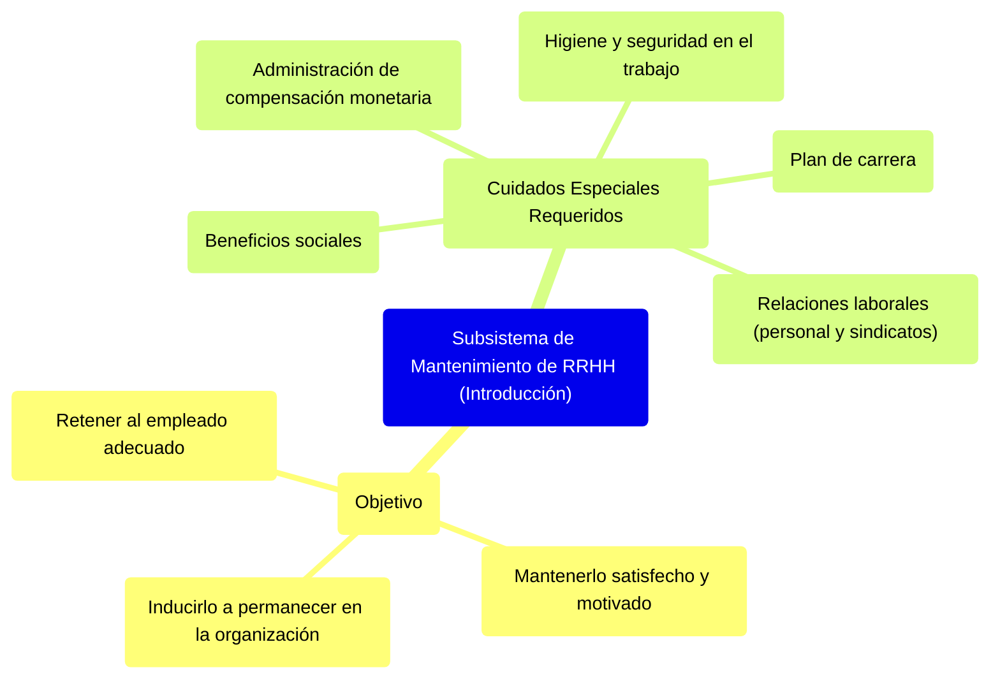

## **Subsistema de mantenimiento de RRHH** {#subsistema-de-mantenimiento-de-rrhh}

Una organización es viable no sólo si capta y emplea sus recursos humanos de manera adecuada, sino que también los mantiene en la organización. Esto es **retener al empleado adecuado, manteniéndolo satisfecho y motivado**, induciéndolo a permanecer en la organización. Esto exige una serie de cuidados especiales, entre los que sobresalen la administración de compensación monetaria, beneficios sociales e higiene y seguridad en el trabajo, plan de carrera y relación laborales (con el personal y sindicatos).

![][image83] 