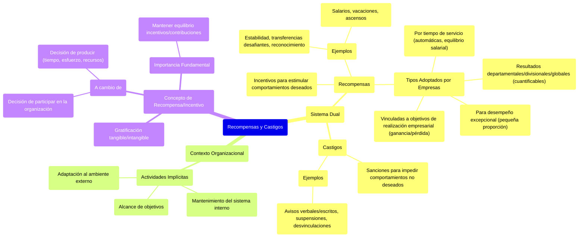

### Recompensas y castigos {#recompensas-y-castigos}

Se trata de un sistema de recompensas (incentivos para estimular ciertos tipos de comportamientos) y castigos (sanciones o penas \-reales o potenciales- para impedir ciertos tipos de comportamientos).

**En el sistema de recompensas** no solo se consideran los salarios, vacaciones, ascensos a posiciones más elevadas (con mayores salarios y beneficios), sino también algunas recompensas como garantía de estabilidad en el cargo, transferencias laterales hacia posiciones más desafiantes o hacia posiciones que lleven a un progreso, a un desarrollo adicional y a varias formas de reconocimiento por servicios notables.  
![][image84]  
**El sistema de castigos** va desde avisos verbales o escritos, suspensiones, o desvinculaciones de la organización.

La mayor parte de las empresas adoptan **4 tipos de recompensas**:

* Aquellas que pueden estar directamente vinculadas al criterio de los objetivos de realización empresarial, como la ganancia o la pérdida (mayormente orientada a directivos).  
* Aquellas que se aplican en virtud del tiempo de servicio del empleado y que se conceden de manera automática en ciertos intervalos, siempre que el desempeño del empleado no haya sido insatisfactorio. En general, tales incentivos son pequeños y buscan ante todo mantener el equilibrio salarial.  
* Aquellas que alcanzan una pequeña proporción de individuos de desempeño excepcional.  
* Las que contemplan resultados departamentales, divisionales o globales, objetivamente cuantificables

En la definición de organización, están implícitas **tres clases de actividades:**

1. Alcance de objetivos  
2. Mantenimiento del sistema interno  
3. Adaptación al ambiente externo

Las cuatro recompensas anteriores hacen referencia a la primera contribución. 

**La recompensa o incentivo es** alguna gratificación, tangible o intangible, a cambio de la cual las personas se hacen miembros de la organización (decisión de participar) y, una vez en la organización, contribuyen con tiempo, esfuerzo u otros recursos válidos (decisión de producir). Cualquiera sea el propósito, el producto o la tecnología de la organización, **es fundamental mantener el equilibrio entre incentivos/contribuciones.**

![][image85] 