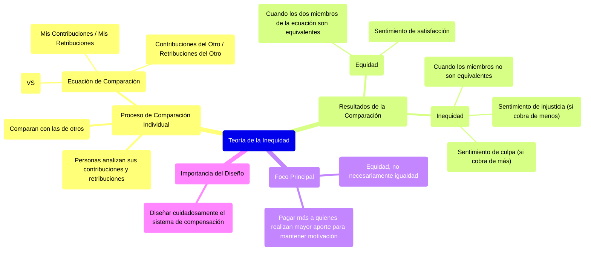

### Teoría de la inequidad {#teoría-de-la-inequidad}

Las personas hacen contribuciones a la organización, y de esta reciben incentivos o recompensas. Cada persona analiza sus propias contribuciones y retribuciones y las compara con las de los demás:  
![][image86]

Cuando los dos miembros de la ecuación son equivalentes, se da una situación de equidad y la persona experimenta un sentimiento de satisfacción.

**Cuando hay inequidad, la persona experimenta un sentimiento de injusticia y de insatisfacción** (ya sea injusticia cuando cobra de menos, o de culpa cuando cobra de más).  
![][image87]

En este tema **siempre** **tratamos la equidad, y no necesariamente la igualdad,** para mantener motivadas a las personas se debe pagar más a aquellas que realizan un mayor aporte a la organización. No es lo mismo un dev que empezó a trabajar ayer, que un dev con mayor seniority, por la experiencia pueden alcanzar mayores niveles de productividad y aportes más complejos, por lo que el sueldo no debería ser el mismo. Por esto debemos diseñar cuidadosamente el sistema de compensación 