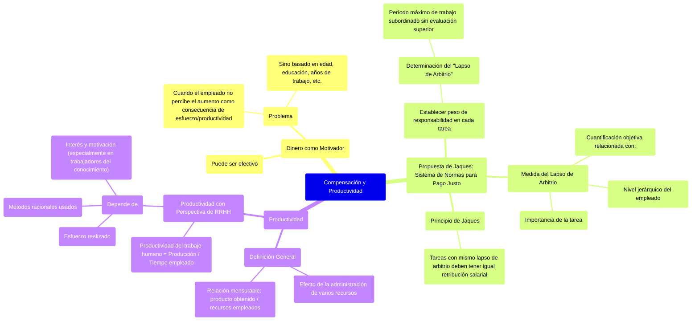

### Compensación y productividad {#compensación-y-productividad}

El dinero puede ser un motivador efectivo, **el problema sucede cuando el empleado no percibe el aumento como consecuencia al aumento de su esfuerzo y productividad,** sino piensen que se basa en la edad, educación, en los años de trabajo, etc.

Jaques propone un sistema de normas para lograr un justo pago, cualquiera sea el nivel del trabajo y la tarea realizada.

Se debe **establecer el peso de la responsabilidad en cada tarea ejecutada**, lo cual puede hacerse determinando el período máximo durante el cual el subordinado puede realizar el trabajo \-bajo su propio arbitrio e iniciativa- que el superior le asignó, sin que esos elementos sean sometidos a la evaluación del superior: este tiempo se denomina lapso de arbitrio.

La medida del lapso de arbitrio es una cuantificación objetiva que se relaciona con dos aspectos:

* La importancia de la tarea ejecutada  
* El nivel jerárquico del empleado.

Según Jaques, **los individuos que cumplen diferentes tareas que poseen el mismo lapso de arbitrio deben tener la misma retribución salarial.**

**Productividad →**  se la entiende como un **efecto**,  y no una causa, de la administración de varios recursos. Es una relación mensurable entre el producto obtenido (resultado o salida) y los recursos empleados para esa producción.  
**Productividad con perspectiva a los RRHH →**  la productividad del trabajo humano es igual al cociente entre la producción y el tiempo empleado en ella. Depende no sólo del esfuerzo realizado y métodos racionales usados, sino también del **interés y motivación de las personas**, sobre todo si hablamos de trabajadores del conocimiento. 