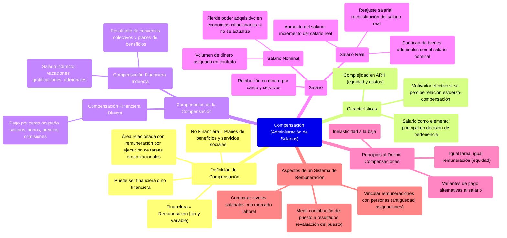

### Compensación (administración de salarios) {#compensación-(administración-de-salarios)}

Compensación es el área relacionada con la remuneración que el individuo recibe como retorno por la ejecución de tareas organizacionales. **La compensación puede ser financiera o no**, la financiera constituye lo que normalmente hablamos como remuneración, pero la compensación constituye a la remuneración en todas sus formas posibles.

![][image88]

* Es una de las cuestiones más complejas de la ARH (cuidar cuestiones de equidad y de costos)  
* **Es un motivador efectivo** si el empleado percibe que el aumento de su esfuerzo lleva de hecho el aumento de la compensación. Hay que tener en cuenta que **el salario compone el elemento principal en la decisión de pertenecer a una organización,** en mayor o menor medida dependiendo del empleado, pero es indispensable para vivir y una necesidad básica que la organización debe satisfacer.  
* Se compone de la administración de las remuneraciones (fijas y variables) y de los planes de beneficios y servicios sociales

![][image89]

**La compensación financiera directa** es el pago que recibe cada empleado en forma de salarios, bonos, premios y comisiones → **se recibe como contraprestación del servicio en el cargo ocupado**,  le damos al empleado dinero atado directamente a las tareas y funciones o servicios que presta el empleado. *Aca los bonos son una remuneración variable atado a una meta, mientras que el salario es una remuneración fija.*

**La compensación financiera indirecta** constituye el **salario indirecto**, resultante de cláusulas de la convención colectiva de trabajo y del plan de **beneficios y servicios sociales** ofrecidos por la organización. El salario indirecto incluye vacaciones, gratificaciones, propinas, adicionales, etc.  
![][image90]  
**⇒ El salario** es la retribución en dinero o su equivalente que el empleador paga al empleado por el cargo que éste ejerce y por los servicios que presta durante determinado periodo.

* **El salario nominal** representa el volumen de dinero asignado en el contrato individual por el cargo ocupado. En una economía inflacionaria, el salario nominal pierde poder adquisitivo si no se actualiza con periodicidad.   
* **El** **salario real** representa la cantidad de bienes que el empleado puede adquirir con aquel volumen de dinero. **El salario nominal se modifica para proporcionar el salario real equivalente al periodo anterior.** De aquí proviene la distinción entre **reajuste salarial** (reconstitución del salario real) y **aumento del salario** (incremento del salario real).

**Al definir las compensaciones se deben seguir 3 principios:**

* **Inelasticidad a la baja:** Los sueldos no pueden bajarse. Cuando la empresa descubre que está pagando más que el mercado por un determinado puesto, no se debería bajar el sueldo. Por eso la importancia de la investigación externa (sobre el mercado laboral) previa a la definición de la remuneración.  
* **Igual tarea, igual remuneración:** Garantizar la equidad en las remuneraciones  
* **Variantes de pago alternativas al salario**

**En esencia, un sistema de remuneración consta de 3 aspectos:**

* Medir el grado en que el puesto de trabajo contribuye al logro de los resultados de la empresa (evaluación del puesto)  
* Comparar los niveles salariales con los vigentes del mercado laboral  
* Vincular las remuneraciones con las personas (antigüedad, asignación por hijo, ayuda escolar) . Por lo general, cuando una persona ingresa a la empresa, se le fija como salario el límite inferior de la categoría del puesto que ocupará ⇒ en la medida en que su desempeño lo justifique, pueda ir avanzando y recibiendo aumentos individuales.

![][image91] 