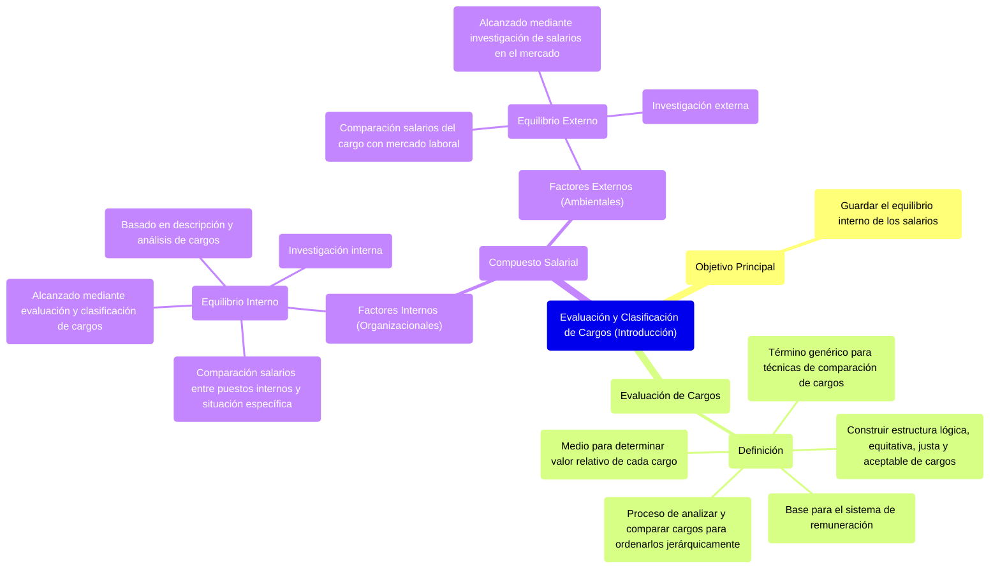

### Evaluación y clasificación de cargos {#evaluación-y-clasificación-de-cargos}

Sirven para guardar el equilibrio interno de los salarios.

La **evaluación de cargos** es un término genérico que abarca varias técnicas mediante las cuales se aplican criterios comunes de comparación de cargos para construir una estructura lógica, equitativa, justa y aceptable de los cargos. **Es el proceso de analizar y comparar los cargos con el fin de colocarlos en un orden de jerarquización que sirva de base al sistema de remuneración.** Es un medio de determinar el valor relativo de cada cargo dentro de la estructura organizacional

#### ***El compuesto salarial***

Hay una serie de factores internos (organizacionales) y externos (ambientales) que condicionan los salarios y determinan sus valores. El conjunto de estos factores internos y externos se denomina compuesto salarial.  
![][image92]

#### ***Concepto de administración de salarios***

Conjunto de normas y procedimientos tendientes a establecer o mantener estructuras de salarios equitativas y justas en la organización, en relación a:

* Los salarios, respecto de los demás cargos dentro de la organización.  
* Los salarios, respecto de los mismos cargos en otras empresas.

| Al determinar las remuneraciones para que sean adecuadas, se debe intentar lograr el equilibrio interno y externo. Con esta información la organización establece una política salarial. |  |  |
| ----- | :---- | ----- |
| **Equilibrio interno** | Comparación entre los niveles salariales vigentes entre puestos de la organización y la situación específica de la misma salario de un puesto \<-\> salario de otro puesto **Factores internos** (organizacionales) | Se alcanza mediante la información interna obtenido a través de la evaluación y clasificación de cargos (se usa algún método de evaluación de cargos) basadas en un programa previo de descripción y análisis de cargos (entrada fundamental del subsistema) **Investigación interna** |
| **Equilibrio externo** | Los salarios de un cargo con respectos de los mismos cargos de otros empresas salarios organización \<-\> salarios mercado laboral **Factores externos** (ambientales o del entorno) | Se alcanza a través de la información externa obtenida de la investigación de salarios en el mercado. Resultados de la comparación entre los niveles salariales vigentes con los del mercado laboral. **Investigación externa** |
| **Compuesto salarial (wage mix)** | Es el conjunto de factores internos y externos que condicionan los salarios y determinan sus valores |  |