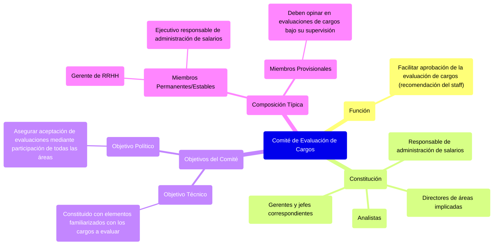

#### ***Comité de evaluación de cargos*** {#comité-de-evaluación-de-cargos}

La evaluación del cargo es una recomendación del organismo de *staff,* que deberá ser aprobada por el organismo de línea y por la dirección de la organización. Para facilitar este trabajo de aprobación se utiliza el comité de evaluación, constituido por **el responsable de la administración de salarios** y los **analistas**, los directores cuyas áreas estén implicadas en el trabajo, los gerentes y los jefes a quienes corresponda.

El comité de evaluación de cargos **tiene dos objetivos**:

* *Objetivo técnico.* El comité se constituye con los elementos de las diversas áreas de la organización más familiarizados con los cargos que serán evaluados.  
* *Objetivo político.* Al contar con la participación de elementos pertenecientes a todas las áreas de la organización, las evaluaciones se aceptarán sin restricciones.

El comité de evaluación de cargos **está constituido por lo general por**:

* *Miembros permanentes o estables:* como el gerente de RRHH y el ejecutivo responsable de la administración de salarios.  
* *Miembros provisionales:* deberán opinar en las evaluaciones de los cargos bajo su supervisión. 