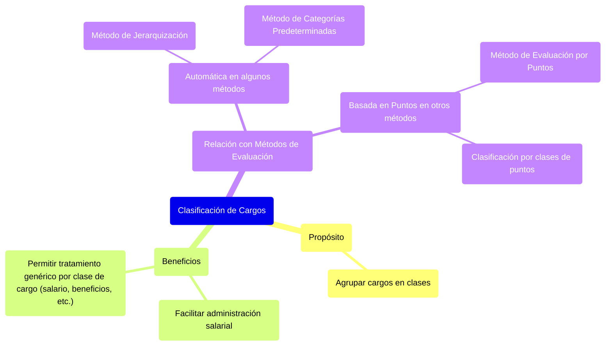

#### ***Clasificación de cargos*** {#clasificación-de-cargos}

El agrupamiento de los cargos en clases busca facilitar no solo la administración salarial, sino **permitir también que cada clase de cargo tenga un tratamiento genérico** (en cuanto a salario, beneficios sociales, etc.).

Algunos métodos de evaluación de cargos tienden a proporcionar automáticamente una clasificación de cargos; es el caso del método de jerarquización y el de las categorías predeterminadas. Otros métodos como el de evaluación por puntos, proporcionan cierto número de puntos para cada cargo, lo cual permite que la clasificación de dichos cargos se haga por clases de puntos. 