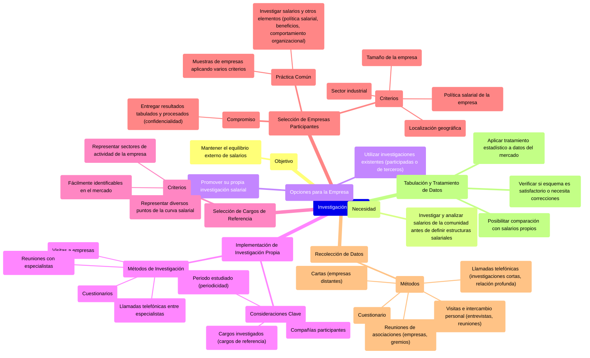

### Investigación salarial {#investigación-salarial}

Para **mantener el equilibrio externo**, antes de definir las estructuras salariales de la empresa, es conveniente investigar y analizar los salarios de la comunidad. La empresa podrá:

* Utilizar investigaciones hechas por empresas en las cuales haya participado.  
* Utilizar investigaciones hechas por empresas especializadas.  
* Promover su propia investigación salarial.

La implementación de una investigación de salarios **debe tener en cuenta:**

* Cuáles son los cargos investigados (cargos de referencia).  
* Cuáles son las compañías participantes.  
* Cuál es el periodo estudiado o investigado (periodicidad).

La investigación de salarios **puede hacerse por medio de:**

* Cuestionarios  
* Visitas a empresas  
* Reuniones con especialistas en salarios  
* Llamadas telefónicas entre especialistas en salarios.

**Selección de los cargos de referencia**

Los cargos de referencia pueden ser:

* Cargos que representan los diversos puntos de la curva salarial de la empresa  
* Cargos fácilmente identificables en el mercado.  
* Cargos que representan los sectores de actividad de la empresa.

**Selección de las empresas participantes**

Los **criterios** son los siguientes:

* Localización geográfica de la empresa  
* Sector industrial de la empresa. Muchas empresas seleccionan para sus investigaciones otras del mismo sector industrial.   
* Tamaño de la empresa  
* Política salarial de la empresa.

Cuando se trata de una investigación salarial amplia, es común escoger muestras de empresas aplicando varios de los criterios. Además de los salarios, pueden investigarse otros elementos, como la información de política salarial y de los beneficios que las empresas ofrecen, así como datos sobre el comportamiento organizacional.

La empresa que investiga y obtiene información de las demás se compromete a entregarles los resultados de la investigación debidamente tabulados y procesados, manteniendo ciertos límites de confidencialidad de la información.

**Recolección de datos**

* Cuestionario  
* Visitas y el consiguiente intercambio personal de información, mediante entrevistas o reuniones.  
* Reuniones de asociaciones de empresas o asociaciones de gremios.  
* Cartas, cuando las empresas investigadas están localizadas en sitios distantes.  
* Llamadas telefónicas, cuando las investigaciones son cortas y la relación entre los ejecutivos de las empresas es más profunda.

![][image100]

**Tabulación y tratamiento de los datos**  
Teniendo ya los datos del mercado, la empresa los tabulara y les aplicará el tratamiento estadístico de los datos para posibilitar la comparación con sus propios salarios y verificar si su esquema es satisfactorio o necesita correcciones.

![][image101] 