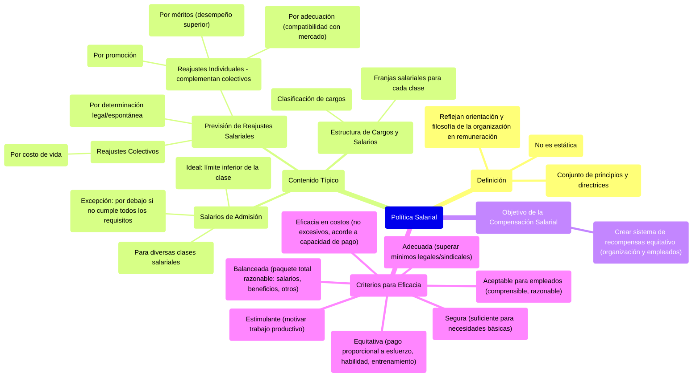

### Política salarial {#política-salarial}

La política salarial es el **conjunto de principios y directrices que reflejan la orientación y la filosofía de la organización en lo que corresponde a la remuneración de sus empleados.** La política salarial **no es estática.** Debe contener:

* *Estructura de cargos y salarios.* Clasificación de los cargos y las franjas salariales para cada clase de cargos  
* *Salarios de admisión para las diversas clases salariales.* El salario de admisión para empleados debe coincidir con el límite inferior de la clase salarial. No obstante, cuando el elemento reclutado no cumpla en su totalidad los requisitos exigidos por el cargo, el salario de admisión podrá estar por debajo del límite mínimo.  
* *Previsión de reajustes salariales,* ya sea por determinación legal (acuerdos colectivos) o espontánea. Puede tratarse de:  
  * *Reajustes colectivos* (o por costo de vida).  
  * *Reajustes individuales. Complementan* los ajustes colectivos y pueden clasificarse en:  
  * *Reajustes por promoción*.  
  * *Reajustes por adecuación.* La empresa trata de pagar salarios compatibles con los salarios pagados en el mercado de trabajo.  
  * *Reajustes por méritos.* Se conceden a los empleados que deben ser recompensados por su desempeño superior al normal.

El objetivo de la compensación salarial es crear un sistema de recompensas equitativo para la organización y los empleados. Para ser eficaz debe tener en cuenta los siguientes criterios:

* **Adecuada**: La compensación debe distanciarse de los estándares mínimos del gobierno y del sindicato.  
* **Equitativa**: A cada persona, debe pagarse proporcionalmente a sus esfuerzos, sus habilidades y su entrenamiento.  
* **Balanceada**: Salarios, beneficios y otras recompensas debe proporcionar un paquete total razonable de recompensas  
* **Eficacia en cuanto a costos**: Los salarios no pueden ser excesivos y deben estar de acuerdo con lo que cada organización puede pagar.  
* **Seguro**: Los salarios deben ser suficientes para brindar seguridad a los empleados y ayudarles a satisfacer sus necesidades básicas.  
* **Estimulante**: Los salarios deben motivar eficazmente el trabajo productivo.  
* **Aceptable para los empleados**: los empleados deben comprender el sistema de salarios y sentir que es razonable para ellos y para la empresa. 