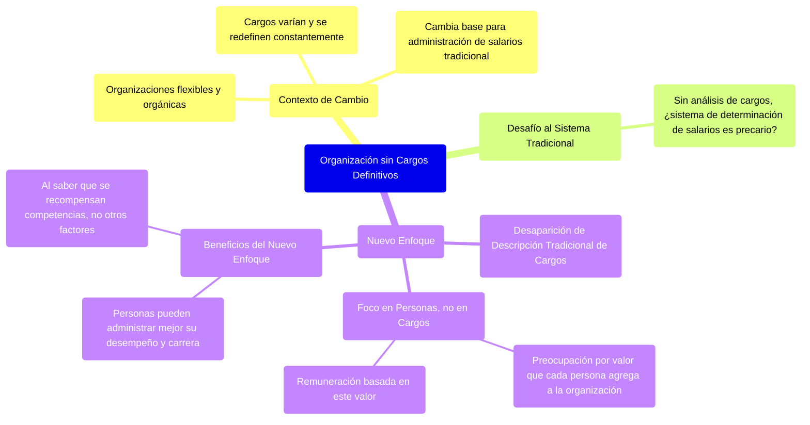

### Organización sin cargos definitivos {#organización-sin-cargos-definitivos}

Las organizaciones están volviéndose flexibles y orgánicas, y sus cargos varían, pues se redefinen constantemente, lo cual cambia toda la base para la administración de salarios, que se torna movediza. La pregunta obligada es: sin el análisis de cargos, que sirva de base y fundamento al proceso de evaluación de cargos, ¿el sistema de determinación de salarios es precario y obsoleto? Parece que sí.

La descripción tradicional de cargos tiende a desaparecer. **En vez de centrarse en los cargos se focaliza en las personas que los ocupan**. En lugar de centrarse en el valor relativo de cada cargo para la organización, el nuevo proceso se preocupa por el valor que cada persona puede agregar a la organización y en base a esto se lo remunera.

**Al saber que la empresa recompensa determinadas competencias y no simplemente otros factores, las personas están en condiciones de administrar mejor su desempeño y su carrera.** 