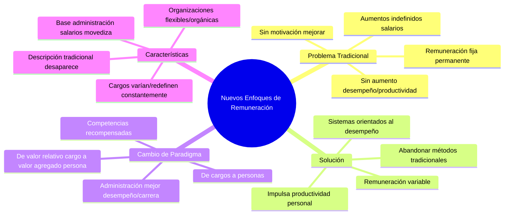

# Nuevos Enfoques de Remuneración

## El Problema de la Remuneración Tradicional

Las organizaciones no pueden continuar **aumentando indefinidamente los salarios en determinado porcentaje anual** para estar a tono con los aumentos del costo de vida, **si no se produce un aumento correspondiente en el desempeño y en la productividad**. Por esta razón, muchas organizaciones están implementando **nuevos sistemas de remuneración orientados hacia el desempeño**, y abandonando los métodos tradicionales de remuneración fija.

Como la **remuneración tradicional es fija y permanente**, las personas **no tienen motivo para desempeñarse mejor**, sobre todo cuando los salarios de la empresa son iguales y los desempeños son desiguales. Las organizaciones han hecho grandes esfuerzos por aumentar la productividad y la eficiencia.

## La Solución: Remuneración Variable

**La productividad de las personas sólo aumenta y se mantiene cuando también están interesadas en producir más. Y la remuneración variable impulsa el aumento de la productividad personal.**

## Cambio de Paradigma: De Cargos a Personas

Las organizaciones están volviéndose **flexibles y orgánicas**, y sus cargos varían, pues **se redefinen constantemente**, lo cual cambia toda la base para la administración de salarios, que se torna movediza. La pregunta obligada es: sin el análisis de cargos, que sirva de base y fundamento al proceso de evaluación de cargos, ¿el sistema de determinación de salarios es precario y obsoleto? Parece que sí.

### El Nuevo Enfoque

La **descripción tradicional de cargos tiende a desaparecer**. **En vez de centrarse en los cargos se focaliza en las personas que los ocupan**. En lugar de centrarse en el valor relativo de cada cargo para la organización, el nuevo proceso **se preocupa por el valor que cada persona puede agregar a la organización** y en base a esto se lo remunera.

**Al saber que la empresa recompensa determinadas competencias y no simplemente otros factores, las personas están en condiciones de administrar mejor su desempeño y su carrera.** 