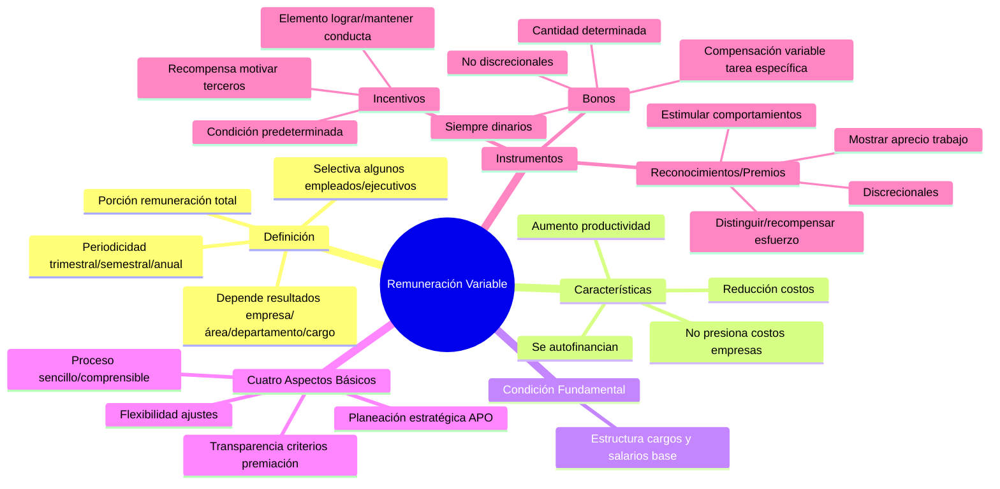

# Remuneración Variable

## Definición

**Remuneración variable** es la porción de la remuneración total que se le paga al empleado con **periodicidad trimestral, semestral o anual**. **Es selectiva (para algunos empleados y ejecutivos) y depende de los resultados logrados por la empresa** (sea en el área, el departamento o el cargo) en determinado periodo mediante el trabajo en equipo o el trabajo individual de cada empleado.

## Características Principales

La remuneración variable **no presiona el costo de las empresas**, pues estas **se autofinancian con el aumento de la productividad y la reducción de costos.**

## Condición Fundamental

La condición fundamental para la implementación de la remuneración variable es que la empresa tenga **una estructura de cargos y salarios que sirva de base al sistema.**

## Cuatro Aspectos Básicos

La remuneración variable requiere **cuatro aspectos básicos:**

1. **La planeación estratégica de la empresa debe estar orientada hacia una administración por objetivos (APO).**
2. **Proceso sencillo y de fácil comprensión y seguimiento** que permita la cuantificación objetiva del desempeño de la empresa, de las unidades y de los empleados.
3. **Flexibilidad**, de modo que permita introducir ajustes cuando sean necesarios.
4. **Transparencia en los criterios de premiación**

## Instrumentos de Remuneración Variable

### Incentivos

Un **incentivo** es un elemento destinado a lograr y/o mantener una determinada conducta. Es una **recompensa que se fija para motivar a terceros** (uno o varios) a actuar de una manera deseada → es **atribuido a una condición predeterminada** (por ejemplo nivel de productividad o nivel de desempeño).

Los incentivos pueden ser **dinerarios o no dinerarios**; pagarse al **corto o al largo plazo**; pueden ser **presupuestados o autofinanciados**, y **no son discrecionales**.

### Bonos

Un **bono** es una forma de compensación variable asociada, en este caso, **a una tarea específica**. Si la tarea se cumple, se accede al bono.

Los bonos son **siempre dinarios**, y se otorgan en una **cantidad determinada**. Se **presupuestan**. Y **no son discrecionales**: cualquier empleado que cumpla con la tarea asociada al bono, tiene el derecho al bono.

### Reconocimientos o Premios

Los **reconocimientos o premios** son acciones orientadas a **estimular comportamientos y distinguir o recompensar el esfuerzo personal o grupal**. Con esto se busca **mostrar aprecio por el trabajo y las buenas prácticas realizadas**.

Pueden establecerse sobre **criterios amplísimos**, se otorgan **después del hecho** y se centran en el **comportamiento**, pueden ser **dinerarios o no dinerarios**, se **presupuestan** y a diferencia de los incentivos y bonos **son discrecionales** (el jefe determina o elige a qué empleado se le otorgará).

## Diferencia con Beneficios Sociales

La diferencia entre **beneficios sociales y remuneración variable** (implementada ya sea a través de incentivos, de bonos y/o de reconocimientos) es que los **beneficios sociales son una serie de derechos de los que goza el empleado por el simple hecho de pertenecer a la organización** y **no están ligados a una meta ni un resultado**. 