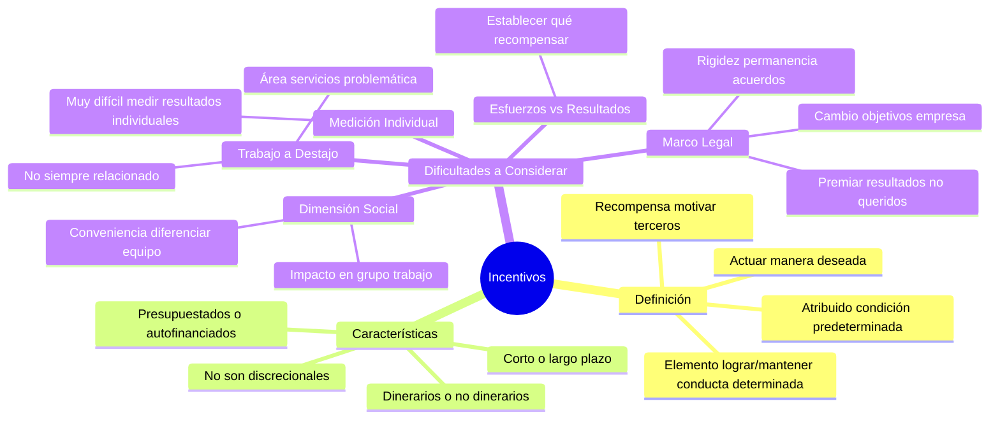

# Incentivos

## Definición

Un **incentivo** es un elemento destinado a **lograr y/o mantener una determinada conducta**. Es una **recompensa que se fija para motivar a terceros** (uno o varios) **a actuar de una manera deseada** → es **atribuido a una condición predeterminada** (por ejemplo nivel de productividad o nivel de desempeño).

## Características de los Incentivos

Los incentivos pueden ser:
- **Dinerarios o no dinerarios**
- **Pagarse al corto o al largo plazo**
- **Presupuestados o autofinanciados**
- **No son discrecionales**

## Dificultades a Considerar

**Se deben considerar algunas dificultades:**

### 1) Esfuerzos vs Resultados
**Establecer si los incentivos recompensará esfuerzos o resultados**

### 2) Trabajo a Destajo
**El incentivo no siempre estará relacionado con el trabajo a destajo, fundamentalmente en el área de servicios.**

### 3) Medición Individual
**Es muy difícil medir los resultados individuales**

### 4) Dimensión Social del Recurso Humano
**¿Es conveniente en un equipo de trabajo o grupo diferenciar a sus integrantes mediante incentivos?**

### 5) Marco Legal
**La existencia del marco legal.** El incentivo se fija siempre en relación con el alcance de las metas. Hoy una empresa puede incentivar cierto tipo de resultados, por lo que se diseña el sistema de incentivos, se establece el acuerdo entre las partes y se lo pone en funcionamiento. Luego de cierto tiempo estos resultados ya no son los que persigue la empresa, son otros. Pero, **la fijación de los incentivos impone cierta rigidez y permanencia, característica de los acuerdos laborales**, y la empresa puede verse en la situación de **tener que premiar resultados no queridos**. 