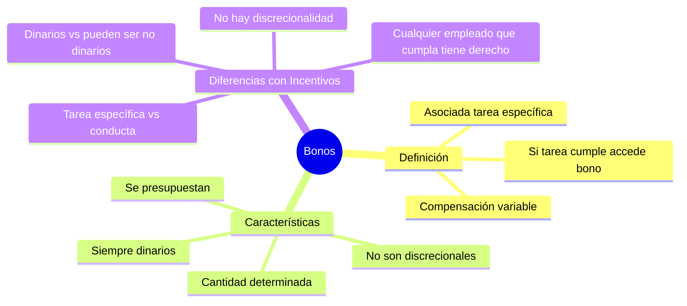

# Bonos

## Definición

Un **bono** es una forma de **compensación variable asociada, en este caso, a una tarea específica**. **Si la tarea se cumple, se accede al bono.**

## Características de los Bonos

Los bonos tienen las siguientes características distintivas:

- **Son siempre dinarios**
- **Se otorgan en una cantidad determinada**
- **Se presupuestan**
- **No son discrecionales**: cualquier empleado que cumpla con la tarea asociada al bono, tiene el derecho al bono

## Diferencias con Otros Instrumentos

A diferencia de los incentivos, los bonos:
- Se asocian a **tareas específicas** (no a conductas generales)
- Son **siempre monetarios** (los incentivos pueden ser no dinerarios)
- **No tienen discrecionalidad**: cualquier empleado que cumpla la tarea tiene automáticamente derecho al bono 