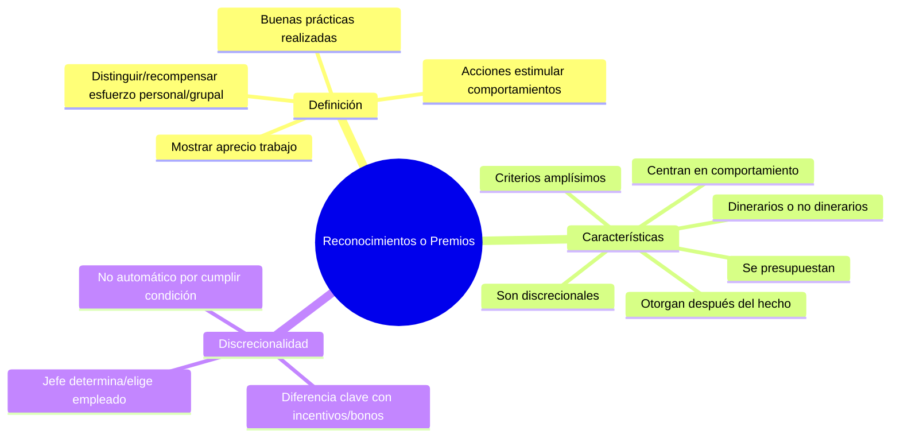

# Reconocimientos o Premios

## Definición

Los **reconocimientos o premios** son acciones orientadas a **estimular comportamientos y distinguir o recompensar el esfuerzo personal o grupal**. Con esto se busca **mostrar aprecio por el trabajo y las buenas prácticas realizadas**.

## Características de los Reconocimientos

Los reconocimientos o premios tienen las siguientes características:

- **Pueden establecerse sobre criterios amplísimos**
- **Se otorgan después del hecho**
- **Se centran en el comportamiento**
- **Pueden ser dinerarios o no dinerarios**
- **Se presupuestan**
- A diferencia de los incentivos y bonos **son discrecionales** (el jefe determina o elige a qué empleado se le otorgará)

## La Discrecionalidad como Diferencia Clave

La principal diferencia entre reconocimientos/premios y otros instrumentos de remuneración variable (incentivos y bonos) es la **discrecionalidad**:

- **Incentivos y bonos**: No son discrecionales - cualquier empleado que cumpla las condiciones tiene derecho automático
- **Reconocimientos/premios**: Son discrecionales - el jefe o la administración decide quién los recibe

Esta característica permite mayor flexibilidad pero también requiere mayor cuidado en la aplicación para mantener la equidad y transparencia. 