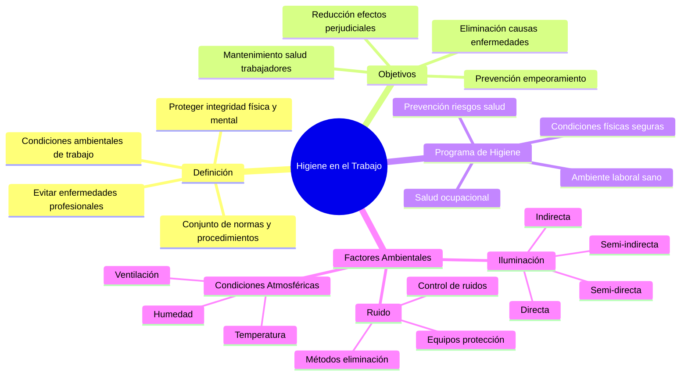

# Higiene en el Trabajo

## Definición y Objetivos

La **higiene en el trabajo** se refiere al conjunto de normas y procedimientos tendientes a la protección de la integridad física y mental del trabajador, preservándolo de los riesgos de salud inherentes a las tareas del cargo y al ambiente físico donde se ejecutan.

### Objetivos de la Higiene en el Trabajo

1. **Eliminación de las causas de enfermedades profesionales**
2. **Reducción de los efectos perjudiciales** provocados por el trabajo en personas enfermas o portadoras de defectos físicos
3. **Prevención del empeoramiento** de enfermedades y lesiones  
4. **Mantenimiento de la salud** de los trabajadores y **aumento de la productividad** por medio del control del ambiente de trabajo

## Programa de Higiene en el Trabajo

Un programa de higiene en el trabajo cubre:

### Ambiente Laboral Sano
Implica el mantenimiento, la limpieza del espacio físico.

### Prevención de Riesgos sobre la Salud
- Riesgos por químicos
- Calidad ambiental en espacios cerrados (iluminación, humedad, etc.)
- Humo del tabaco
- Terminales de computadoras (visual, postura)
- Lesiones por movimiento repetitivos
- Aspectos emocionales
- Estrés/agotamiento

## Factores Ambientales de Trabajo

### Iluminación

La **iluminación** es la cantidad de luz que incide en el lugar de trabajo del empleado. No se trata de iluminación en general sino de la cantidad de luz en el punto focal del trabajo. Un sistema de iluminación debe cumplir con los siguientes requisitos:

- Ser **suficiente**: la cantidad de luz debe estar relacionada con la dificultad de la tarea visual
- Ser **constante y uniformemente distribuida**: evita la fatiga de los ojos
- Estar **colocada de manera que evite el encandilamiento, directo o indirecto**

#### Tipos de Iluminación

- **Iluminación directa** → La luz incide directamente sobre la superficie iluminada
- **Iluminación indirecta** → La luz incide sobre la superficie que va a ser iluminada mediante reflexión en paredes y techos  
- **Iluminación semi-indirecta** → Combina los anteriores  
- **Iluminación semi-directa**

### Ruido

El **ruido** se considera un sonido o barullo indeseable. Tiene dos características principales:
- **La frecuencia** (número de vibraciones por segundo (cps))
- **La intensidad** (db)

Estudios indican que el ruido no provoca disminución en el desempeño del trabajo, sin embargo **la exposición prolongada a elevados niveles de ruido produce pérdida de la audición proporcional al tiempo de exposición.**

#### Factores que Afectan el Ruido

El efecto desagradable del ruido depende de:
- Intensidad del sonido  
- Variación de los ritmos  
- Frecuencia o tono de los sonidos

El **nivel máximo de ruido** permitido legalmente en un ambiente de trabajo es de **85 db**, por encima de esta cifra se considera insalubre.

#### Control de Ruidos

El control de ruidos **busca la eliminación o reducción de sonidos indeseables**. Estos pueden ser:

- **Continuos** (motores, ventiladores, etc)  
- **Intermitentes** (prensas, forjas, etc)  
- **Variables** (personas que hablan, manejo de herramientas, etc)

#### Métodos de Control de Ruidos

Los **métodos más comunes para controlar los ruidos** en la industria son:

- **Eliminación del ruido** en el elemento que lo produce mediante reparación  
- **Separación de la fuente de ruido**, mediante pantallas o disposición de las máquinas  
- **Aislamiento de la fuente de ruido** dentro de muros a prueba de ruido  
- **Tratamiento acústico** de los techos, paredes y pisos para absorción de ruidos  
- **Equipos de protección individual**, como protector auricular

### Condiciones Atmosféricas

#### Temperatura

Existen cargos cuyo sitio de trabajo se caracteriza por las **altas temperaturas** (horno siderúrgico) o las **temperaturas muy bajas** (frigoríficos), donde el ocupante del cargo debe vestir ropa adecuada para proteger su salud. En estos casos extremos, la **insalubridad constituye una característica principal** en estos ambientes de trabajo.

#### Humedad

La **humedad** es consecuencia del alto grado de contenido higrométrico del aire. Existen condiciones de:
- **Elevada humedad** (telares) 
- **Nula humedad** (industria cerámica) 

En ambos casos extremos, la **insalubridad constituye la característica principal** en el sitio de trabajo. 