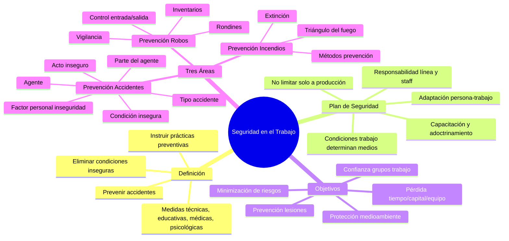

# Seguridad en el Trabajo

## Definición

La **seguridad en el trabajo** es el conjunto de medidas técnicas, educativas, médicas, y psicológicas empleadas para prevenir accidentes y eliminar las condiciones inseguras del ambiente, y para instruir o convencer a las personas acerca de la necesidad de implantar prácticas preventivas.

## Plan de Seguridad

Un **plan de seguridad** implica los siguientes requisitos:

1. **La seguridad en sí es una responsabilidad de línea y una función de staff.**

2. **Las condiciones de trabajo, el ramo de actividad, el tamaño, la ubicación de la empresa, etc., determinan los medios materiales para la prevención.**

3. **La seguridad no se debe limitar tan sólo al área de producción.** Las oficinas, almacenes, etc., también presentan riesgos que afectan a toda la empresa.

4. **El plan de seguridad implica, necesariamente, que la persona se adapte al trabajo (selección de personal) y que el trabajo se adapte a la persona (racionalización del trabajo).**

5. **La seguridad laboral moviliza todos los elementos necesarios para:**
   - Capacitación y adoctrinamiento de técnicos y obreros
   - Control del cumplimiento de normas de seguridad
   - Simulación de accidentes
   - Inspección periódica de los equipos contra incendio
   - Primeros auxilios
   - Elección, adquisición y distribución de prendas de seguridad (lentes, guantes, overoles, botas, etc.)

## Objetivos

**Su objetivo principal es la minimización de riesgos:**

- **Lesiones** – Pérdida del personal  
- **Pérdida de tiempo**  
- **Pérdida del capital**  
- **Pérdida del equipo de trabajo**  
- **Daño al medioambiente**  
- **Desconfianza entre los grupos de trabajo**

### Consideraciones Especiales para Programadores

**En nuestra área especialmente para los programadores,** existen aplicativos con funcionalidades destinadas a prevenir y rehabilitar las RSI o lesiones por esfuerzo repetitivo, lesiones crónicas, tales como el síndrome del túnel carpiano y la tendinitis. Algunos presentan pruebas médicas, tienen la posibilidad de programar alertas de escritorio y recomendaciones de ejercicios.

## Organismos de Control

**SRT** (Superintendencia de Riesgos del Trabajo): Supervisa, entre otras cosas:
- Cumplimiento de los exámenes médicos en la salud ocupacional
- Exámenes periódicos
- Precios a la transferencia
- Actividad posteriores a ausencias prolongadas
- Precios a la terminación de la relación laboral
- Cumplimiento de las obligaciones del trabajador
- Profesionales y Centros habilitados
- Cumplimiento de las obligaciones del empleador

**ART** (Aseguradoras de Riesgos del Trabajo): Son empresas que respaldan al empleador en caso de que se produzca un siniestro, pagando una determinada suma de dinero al trabajador damnificado (indemnización laboral).

## Las Tres Áreas de la Seguridad

### 1. Prevención de Accidentes

La seguridad busca reducir los accidentes laborales. Podemos definir **"accidente laboral"** como el que se deriva del trabajo y que provoca, directa o indirectamente, una lesión corporal, una alteración funcional o un mal que lleva a la muerte, así como la pérdida total o parcial, permanente o temporal, de la capacidad para trabajar.

La palabra **"accidente"** significa acto imprevisto o, en la mayoría de los casos, perfectamente evitable.

#### Principales Causas de Accidentes

Según la American Standards Association, las principales causas son:

**1. El agente:** Es el objeto o sustancia (máquina, lugar o equipo que se puede proteger adecuadamente) que de manera directa se relaciona con la lesión, como una prensa, mesa, martillo.

**2. La parte del agente:** La estrechamente asociada o relacionada con la lesión, como el volante de la prensa, la pata de la mesa, la cabeza del martillo, etcétera.

**3. La condición insegura:** Es la condición física o mecánica en el lugar, máquina, equipo o instalación (que se pudo proteger o corregir), y puede generar un accidente. Por ejemplo, un piso resbaladizo, con aceite, mojado, con salientes o agujeros, una máquina sin protección, etcétera.

**4. El tipo de accidente:** Es la forma o modo de contacto entre el agente del accidente y el accidentado, o incluso el resultado de ese contacto, como golpes, caídas, resbalones, choques, etcétera.

**5. El acto inseguro:** Es la violación del procedimiento aceptado como seguro; es decir, no usar equipo individual de protección, distraerse o conversar durante el servicio o fumar en un área prohibida.

**6. El factor personal de inseguridad:** Es la característica, deficiencia o alteración mental, psíquica o física (accidental o permanente) que permite el acto inseguro. Éste se deriva de vista defectuosa, fatiga, intoxicación, problemas personales o desconocimiento de las normas y reglas de seguridad.

#### Costos de los Accidentes

**El costo directo del accidente** es el total de gastos que se deriva de las obligaciones contraídas con los empleados expuestos a los riesgos inherentes al ejercicio del trabajo, como gastos médicos y hospitalarios a los accidentados y las respectivas indemnizaciones, sean diarias o por incapacidad permanente. En general, las compañías de seguros cubren estos gastos.

**El costo indirecto del accidente laboral,** según la ABNT, implica gastos de fabricación, generales, utilidades no percibidas y otros factores cuya incidencia varía conforme a la industria. El INPS incluye los siguientes puntos en el costo indirecto del accidente laboral: gastos por el primer tratamiento, gastos sociales, costo del tiempo perdido por la víctima, pérdida por la disminución de rendimiento cuando el accidentado retorna al trabajo, etcétera.

### 2. Prevención de Robos

Un plan de prevención de robos (vigilancia) suele incluir:

**1. Control de entrada y salida de personal:** Se trata de un control visual o de revisión personal de cada individuo que ingresa o sale de la fábrica.

**2. Control de entrada y salida de vehículos.**

**3. Estacionamiento fuera del área de la fábrica.**

**4. Rondines por el interior y por los terrenos de la fábrica:** Son muy comunes los esquemas de rondines en el interior y los alrededores de la fábrica, sobre todo fuera del horario de trabajo, no sólo por vigilancia, sino también para prevenir incendios.

**5. Registro de máquinas, equipos y herramientas:** Las máquinas, equipos y herramientas que utiliza el personal se registran y someten a inventarios periódicos.

**6. Controles contables:** Las áreas de compras, almacenaje, expedición y recepción de mercancías están sujetas a ciertos controles contables.

### 3. Prevención de Incendios

El **fuego** es el resultado de la reacción de tres elementos (combustible, oxígeno del aire y temperatura), y su extinción exige la eliminación de al menos uno de los elementos que componen el **triángulo del fuego**.

Los métodos de prevención y extinción de incendios incluyen:
- Eliminación del combustible
- Eliminación del oxígeno (sofocación)
- Eliminación del calor (enfriamiento)
- Separación de los elementos del fuego 