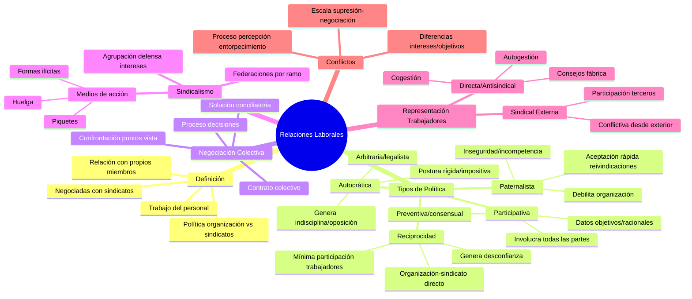

# Relaciones Laborales

## Definición

Las **relaciones laborales** tienen que ver con el trabajo del personal y **son negociadas y acordadas con los sindicatos.** Las relaciones laborales se basan en la política de la organización frente a los sindicatos, tomados como representantes de los anhelos, aspiraciones y necesidades de los empleados. Las relaciones laborales **constituyen la política de relación de la organización con sus propios miembros.**

## Tipos de Políticas de Relaciones Laborales

### Política Paternalista
Se caracteriza por la **fácil y rápida aceptación de las reivindicaciones de los trabajadores**, sea por inseguridad, incapacidad o incompetencia en las negociaciones con los líderes sindicales. Esa postura de corto plazo para resolver problemas **debilita a la organización** y provoca la inseguridad de los gerentes y supervisores de la línea del frente ante las constantes y variadas presiones sindicales.

### Política Autocrática
Se caracteriza por la **postura rígida e impositiva de la organización**, la cual actúa de forma arbitraria y legalista al hacer sólo concesiones dentro de la ley o de acuerdo con sus propios intereses. No siempre se atienden las reivindicaciones, lo que provoca que surjan focos de indisciplina y grupos de oposición dentro del sindicato ante los fracasos en las tentativas de negociación. Por su carácter unilateral e impositivo, **no es sostenible durante un largo periodo** y genera en el personal frustración y actitudes de rebeldía.

### Política de Reciprocidad
Se basa en la **reciprocidad entre la organización y el sindicato**. Las reivindicaciones se resuelven, directa y exclusivamente, entre la dirección de la organización y el sindicato, con una participación mínima de los trabajadores y los supervisores. En realidad, esta política no siempre se cumple, además de que **genera la desconfianza de los trabajadores**, que dejan de creer en los dirigentes del sindicato, como ocurre con los supervisores en relación con los directivos de la organización.

### Política Participativa
Se caracteriza por considerar que las relaciones laborales **involucran al sindicato y a los trabajadores por un lado, y a la organización, sus dirigentes y sus supervisores por el otro**. Se supone que las soluciones se negocian y discuten con datos concretos, objetivos y racionales, además de que no se basan en opiniones personales. Considera al empleado desde el punto de vista social, político y económico, y no sólo como un simple factor de producción. Se trata de una política que se basa en el **consenso de las partes y es estrictamente preventiva**, no correctiva, pues se anticipa a los problemas o, cuando menos, los trata en la medida en que sean controlables, se refuerza y legitima la autoridad de la gerencia y de los supervisores de la organización, al tiempo que se da prestigio al sindicato.

## Negociación Colectiva

**El contrato colectivo de trabajo o el convenio colectivo de trabajo** es un acuerdo de carácter normativo mediante el cual dos o más sindicatos representativos de ramas económicas o profesionales estipulan las condiciones de trabajo aplicables, en el ámbito de sus respectivas representaciones, a las relaciones individuales de trabajo. Así, el contrato colectivo exige un proceso previo de negociaciones entre las partes, la **llamada negociación colectiva,** que se realiza en tres niveles: empresa, sindicato y confederación de sindicatos.

**La negociación sindical es un proceso conductor de la toma de decisiones sobre convenios colectivos** en que participan representantes de los trabajadores y de los empleadores. En esos acuerdos se confrontan los distintos puntos de vista, las expectativas, reclamaciones y exigencias, con el objeto de llegar, por consenso o por mecanismos de concesiones mutuas, a una solución conciliatoria.

### Conceptos para Mejorar las Relaciones Laborales

1. **La organización debe definir con claridad su política de RRHH y divulgarla con los empleados.**

2. **La organización debe desarrollar sistemas y canales de comunicación bidireccionales adecuados** para sentir y percibir las expectativas y reivindicaciones de sus empleados, localizar las fuentes de problemas y de conflictos e identificar sus causas.

3. **La organización debe mantener un diálogo permanente y abierto con los líderes sindicales.**

4. **La organización debe preparar y capacitar a todos los jefes.**

5. **La organización no debe tomar declaraciones y posturas "revolucionarias" de algunos líderes sindicales** como representativas de una tendencia de los obreros, sino ventilarlas en una confrontación directa y en su debida oportunidad.

6. **La organización debe entender que la época del paternalismo terminó** y que debe sustituirse por un trato respetuoso e igualitario.

## El Sindicalismo

Como organización, el **sindicato es una agrupación o asociación que defiende los intereses comunes de sus miembros**. Existen sindicatos de empleados o de trabajadores, y sindicatos patronales o de empleadores. En el ámbito estatal, los sindicatos se agrupan en federaciones, las cuales son instituciones que congregan a sindicatos representativos del mismo ramo de actividad (sean empleados o empleadores) en número mínimo de cinco de ellos.

### Medios de Acción Sindical

#### Huelga
Los empleados de una organización **paralizan colectivamente el trabajo**, de forma general o parcial, **o que disminuyen intencionalmente el ritmo normal de su labor**, con el propósito de conseguir que se modifiquen sus condiciones laborales. Representa una ruptura de las relaciones entre capital y trabajo, ocasionada por un conflicto de intereses entre patrones y empleados.

Una huelga **estalla por consideraciones objetivas, subjetivas o políticas**:

**a) Desde el punto de vista objetivo:** Para reforzar la reivindicación de mejores condiciones laborales, salarios o prestaciones, mejores condiciones para los ascensos, la seguridad, mejores relaciones con los jefes, etcétera.

**b) Desde el punto de vista subjetivo:** Cuando un grupo se siente perjudicado por alguna decisión o acción de la empresa.

**c) Desde el punto de vista político:** En busca de mayor espacio de participación o de ejercicio de poder, sea dentro o fuera de la organización.

#### Piquetes
Son grupos de huelguistas que buscan **alentar a los colegas o impedir la entrada de los empleados que desean trabajar**; incluso coaccionan a quienes no se han adherido a la huelga. El Código Penal prohíbe los grupos de activistas en favor de un movimiento porque propician actos de coacción y de intimidación.

Los activistas de un movimiento pueden ser:
1. **Piquetes en la entrada de la empresa:** Para impedir el ingreso al trabajo.
2. **Piquetes en puntos estratégicos:** Por donde deben pasar los empleados, a efecto de impedir que ingresen al trabajo.

#### Formas Ilícitas de Acción Sindical

- **Huelga simbólica:** Paralización colectiva de corta duración sin abandonar el centro de trabajo.
- **Huelga de advertencia:** Interrupción súbita del trabajo durante un lapso determinado, generalmente breve, antes del término de la jornada.
- **Paro por esmero:** Se cumple el contrato de trabajo con tanta minuciosidad que impide la marcha regular de la producción.
- **Tortuguismo:** El trabajo se efectúa con lentitud o en condiciones técnicas no adecuadas.
- **Paralización relámpago:** Interrupciones colectivas, rápidas e intempestivas en uno o varios sectores.
- **Faltas o retrasos:** Los que trabajan en áreas vitales faltan al trabajo o llegan tarde intencionalmente.
- **Paralización de los proveedores:** Paralizar los suministros de materia prima o servicios indispensables.
- **No trabajar horas extras:** El personal se niega a trabajar horas extras si lo solicita la organización.
- **Ocupación del centro de trabajo:** Forma agresiva de presión sindical donde el personal ocupa el centro de trabajo.
- **Sabotaje:** Con medios violentos y ocultos se destruyen bienes materiales o se dañan máquinas, instalaciones, bienes de la organización.

### Medios de Acción Patronal

#### Cierre Temporal (Lockout)
Cierre temporal de la empresa determinado por sus dirigentes o por el sindicato patronal como medio de presión en las negociaciones sindicales con sus empleados. Este cierre provoca problemas no sólo para los empleados que dejan de trabajar y percibir su remuneración, sino también para la propia comunidad que deja de recibir productos o servicios.

#### Lista Negra
Es un medio ilícito de coacción, porque los empresarios inscriben a los candidatos indeseables desde el punto de vista patronal, y así impiden que obtengan empleo.

## Representación de los Trabajadores en la Organización

### Representación Directa o Antisindical
Implica esquemas internos, como consejos de fábrica y comités de empresa, con facultades que van desde la simple información hasta la participación efectiva en las decisiones de la empresa.

#### Tipos Principales:

**Consejos de fábrica o comités de empresa:** Son grupos de empleados elegidos por votación de los demás colegas (duración de uno o dos años). Tienen por objeto asegurar la expresión colectiva de los asalariados, que permite la protección permanente de sus intereses, en las decisiones relacionadas con la administración y la evolución económico-financiera de la empresa.

**Cogestión o gestión compartida:** Significa también un estilo organizacional en el cual los empleados y los obreros asumen una posición formal en la dirección de la empresa. En estos consejos, los accionistas y los empleados tienen igual representación.

**Autogestión o gestión propia:** Significa que la administración de la organización está a cargo de sus miembros o empleados, y para otros, un modelo de comportamiento democrático participativo, el cual representa una distribución muy amplia del poder en las organizaciones, es decir, la total simetría en el ejercicio del poder.

### Representación Sindical en la Empresa
Implican la participación de sindicatos **fuera de los muros de la organización**. Además de significar la participación de un tercero (empresa, empleados y sindicato), esta participación procede del exterior y suele ser conflictiva, pues no proviene de organismos internos de representación de los trabajadores de la empresa, sino que se deriva de la actuación externa de los sindicatos.

## Conflictos

Las personas nunca tienen intereses y objetivos idénticos. Las diferencias personales en cuanto a intereses y objetivos siempre generan alguna especie de conflicto.

En situaciones de conflicto, las respuestas de un grupo o individuo se tipifican en una escala que va desde los métodos de supresión total hasta los métodos de negociación y resolución de problemas dentro de un *continuum*.

El **conflicto es un proceso que se inicia cuando una de las partes** (sea individuo, grupo u organización) **percibe que la otra entorpece o pretende entorpecer uno de sus intereses**. A medida que se da el cambio, las situaciones se alteran, asimismo la cantidad y calidad de los conflictos tiende a aumentar y a diversificarse. 