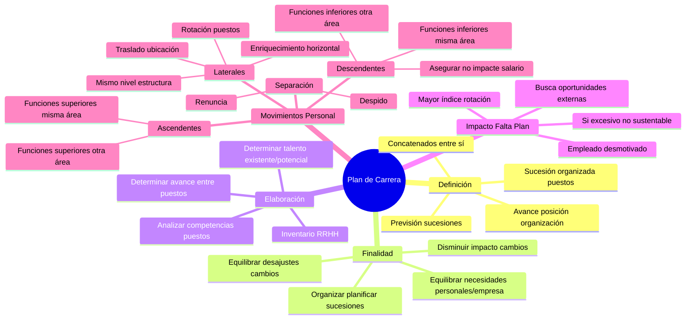

# Plan de Carrera

## Definición

El **plan de carrera** es la sucesión organizada de puestos que se encuentran concatenados unos con otros y van delineando el avance de una posición dentro de la organización.

### ¿Por qué debo armar un plan?

Para poder tener:
- **Previsión de las sucesiones**
- **Reclutamiento interno efectivo**
- **Equilibrar los desajustes posibles por impactos o cambios**
- **Disminuir el impacto** de problemas en el trabajo

## Finalidad del Plan

La finalidad de esto es indispensable: **EQUILIBRAR las necesidades personales y las necesidades de la empresa**.

Para elaborar el plan debo:
1. **Analizar la competencia de toda mi estructura de cargos**
2. **Determinar el avance entre los puestos relacionados**
3. **Determinar el talento existente y potencial** para ocupar esos puestos (CON UN INVENTARIO DE RRHH, me lo da el subsistema desarrollo)

### Finalidad de la Administración de la Carrera

- **Organizar y planificar las sucesiones y reemplazos** (plan de sucesión)
- **Equilibrar los desajustes** producidos entre las necesidades de la organización y las habilidades y conocimientos de los empleados, originados por los cambios tecnológicos y estructurales
- **Disminuir el impacto del cambio organizacional**, las presiones del trabajo y los problemas del trabajo
- **Equilibrar las necesidades del desarrollo de la organización y las necesidades de desarrollo individuales personales**

## Impacto de No Tener un Plan de Carrera Bien Definido

### En un extremo: Sin plan de carrera
**El empleado se siente desmotivado por la ausencia de oportunidades de progreso**, siendo así lo más probable que una vez que sienta que adquirió un mayor de habilidades y conocimientos en un cargo, busque oportunidades y mayores desafíos en otra organización. Es decir que una de las consecuencias de no tener un plan de carrera bien definido se traduce en un **mayor índice de rotación** (provisión).

### Desde el otro extremo: Plan excesivo
**Si el plan de carreras describe un crecimiento excesivo, esto no es sustentable para la organización.** La organización tendrá muchos empleados en niveles altos, y deberá llevar a cabo constantemente procesos de provisión con fuentes externas para llenar los puestos operativos o de menor nivel. Además de la poca sustentabilidad de los sistemas de compensaciones con constantes aumentos de salarios (mantenimiento).

### La Solución: Equilibrio
**Equilibrio** entre lo que necesita la organización (largo plazo) y las necesidades de las personas. Necesidades profesionales y necesidades personales (ofrecen puesto en otro lugar y uno decide quedarse para terminar la carrera).

## Características del Plan de Carrera

**El plan de carrera debe ser:**
- **Conocido por todos**
- **Lo más transparente posible** → Así se sabe a qué reglas me someto
- **Un documento formalizado**
- **Tener definido si las evaluaciones de desempeño son para mejorar**

**Nota importante:** No es por cada puesto ni por persona sino que es la secuencia por la que se puede ir avanzando, los distintos caminos por la organización.

## Elaboración del Plan de Carrera

1. **Analizar las competencias que requieren los puestos** (Análisis y descripción del cargo)
2. **Determinar el avance entre los puestos relacionados**
3. **Determinar el talento existente y potencial para ocupar esos puestos**

## Movimientos de Personal

### Movimientos Ascendentes
Significa **subir un peldaño en la estructura de la empresa**:
- **Funciones superiores dentro del mismo área**
- **Funciones superiores en otra área**

### Movimientos Descendentes
Significa **descender un peldaño en la estructura de la empresa**:
- **Funciones inferiores dentro del mismo área** (lo que hacía antes de subir)
- **Funciones inferiores y en otras áreas**

**Importante:** El movimiento de personal descendente debe asegurar que **no impacte el salario y otras condiciones** (dependiendo del caso) que el empleado haya adquirido previamente. Incluso, en algunas legislaciones se interpreta como que el movimiento descendente debe ser temporal. En nuestra legislación y en particular en nuestro ámbito público, no se aplica. (subrogancia/despido).

### Movimientos Laterales
Significa un **cambio de tareas o de lugar de trabajo, en el mismo nivel de la estructura de la empresa** – categoría del puesto:

#### Rotación de Puestos
- Además significa un **enriquecimiento horizontal**
- Es el modo de que la gente conozca de forma completa los procesos que hay
- Puede llegar a ser útil para la determinación de un nuevo jefe de personal

#### Traslado
Se da cuando, por razones debidamente justificadas (económicas, técnicas, organizativas o de producción), el empleado es enviado a otro centro de trabajo de la misma empresa que exija cambios de residencias por parte del trabajador (**movilidad geográfica**). Es **definitivo**.

**Nota:** En algunos convenios colectivos, existe el "desplazamiento" que difiere del anterior en la temporalidad. Hasta un año.

### Separación
Significa la **desvinculación definitiva del empleado**:
- **Renuncia** (me voy de la empresa)
- **Despido** (hay una causal grave o la empresa cierra) 