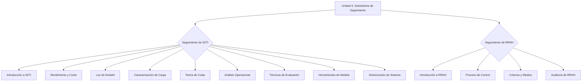

# Índice de la Unidad 5: Subsistema de Seguimiento

## **Índice**

### **Seguimiento de SI/TI**
- [Introducción al Seguimiento de SI/TI](./02_seguimiento_si_ti_intro.md)
- [Rendimiento y Coste](./03_rendimiento_coste.md)
- [Ley de Amdahl](./04_ley_amdahl.md)
- [Caracterización de la Carga](./05_caracterizacion_carga.md)
- [Teoría de Colas](./06_teoria_colas.md)
- [Análisis Operacional](./07_analisis_operacional.md)
- [Técnicas de Evaluación de Sistemas](./08_tecnicas_evaluacion.md)
- [Herramientas de Medida](./09_herramientas_medida.md)
- [Sintonización de un Sistema](./10_sintonizacion_sistema.md)

### **Seguimiento de RRHH**
- [Introducción al Seguimiento de RRHH](./11_seguimiento_rrhh_intro.md)
- [Proceso de Control en RRHH](./12_proceso_control.md)
- [Criterios y Medios de Control](./13_criterios_medios_control.md)
- [Auditoría de RRHH](./14_auditoria_rrhh.md) 