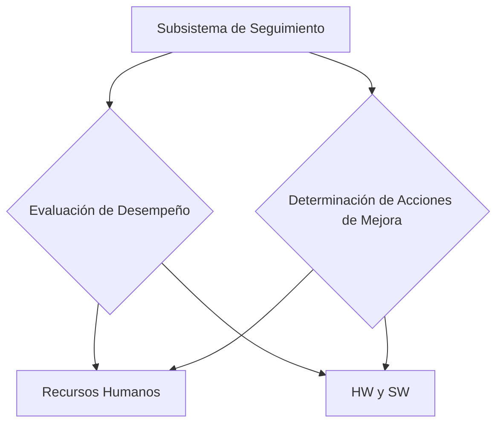

# **Unidad 5: Subsistema de Seguimiento** {#unidad-5-subsistema-de-seguimiento}

El **subsistema de seguimiento** es el subsistema conformado por los procesos, métodos y herramientas que permiten evaluar el grado de adecuación del desempeño/rendimiento de los recursos humanos y de SW y HW a las metas de funcionamiento establecidas y determinar las acciones de mejora adecuadas.

**Seguimiento de los Recursos de HW Y SW**  Evaluación de las prestaciones

**Seguimiento de los RRHH** → Evaluación de desempeño y  Auditoría de la función de RRHH

E**s más complejo analizar el rendimiento de las personas** que de los recursos de SI/TI, por cuestiones relacionadas con la motivación, la resistencia al cambio, etc.

![][image18] 