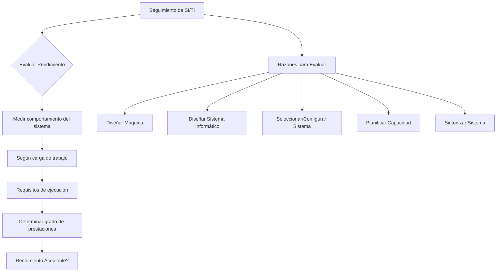

## **Seguimiento de SI/TI** {#seguimiento-de-si/ti}

El subsistema que nutre el subsistema de seguimiento es el subsistema de aplicación de RR SI/TI, a través de la carga de trabajo, la [caracterización de la carga](./05_caracterizacion_carga.md), y la [planificación de las prestaciones](../unidad_3/09_planificacion_capacidad_prestaciones.md) (modelo de explotación).

El **Rendimiento** de un SI es la medida de cómo un SW determinado utiliza el HW con la carga del sistema.

**Evaluar el rendimiento** de un sistema es medir el comportamiento del sistema ante la carga de trabajo de acuerdo con una serie de requisitos de ejecución, para luego determinar el grado de prestaciones (satisfacción de las necesidades de servicio del usuario) que está brindado, y así establecer si este **rendimiento es aceptable**.

El **Subsistema de seguimiento de SI/TI** es el subsistema conformado por los procesos, métodos y herramientas que permiten evaluar el grado de adecuación del rendimiento de los recursos de SW y HW a las metas de funcionamiento establecidas y determinar las acciones de mejora adecuadas.

Puigjanier centra su análisis en el **HW y el SO** (o software de base). Estos dos componentes conforman un sistema informático.

Razones para efectuar la evaluación de las prestaciones:

* Diseñar una máquina  
* Diseñar un sistema informático (arquitectura que tiene que dar soporte a la cartera de aplicaciones)  
* Seleccionar y configurar un sistema informático  
*   Planificar la capacidad de un sistema informático (Relacionado con la unidad de aplicación, desde aquí es donde se sacan los datos)  
* Sintonizar un sistema informático: ajustar los parámetros del SO para que esas prestaciones se adecuen a las prestaciones necesarias de servicio, normalmente para mejorar el comportamiento del sistema. En algunos casos si el sistema no se puede variar, hay que intentar mejorar el comportamiento del sistema modificando la carga → ajustar los parámetros del SO para que esas prestaciones se adecuen a las prestaciones necesarias de servicio. Busco como afino el cuello de botella para volver al rendimiento aceptable. En caso de no poder, se buscará la adquisición. 