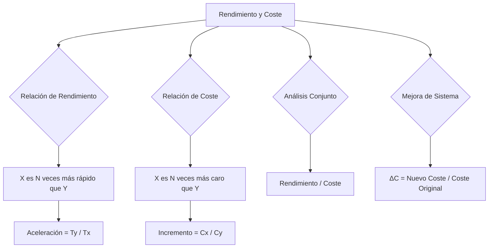

### Relación entre rendimientos

Consideremos dos computadores X e Y**,** los cuales tardan Tx y Ty unidades de tiempo, respectivamente, en ejecutar un programa. Si Tx=Ty diremos que el rendimiento de ambas máquinas es igual o equivalente, ya que en ambas obtenemos el mismo tiempo de ejecución. 

Por el contrario, si Tx \< Ty, el computador X tarda menos tiempo en ejecutar el programa. Esta relación nos permite afirmar que "X es más rápido que Y**".** Sin embargo, nuestro objetivo es cuantificar esta relación y decir que "X es *tantas veces más* rápido que Y**".** El valor numérico al que nos estamos refiriendo recibe el nombre de aceleración *(speedup) y* se puede calcular como la relación entre el tiempo de ejecución más grande y el más pequeño:

Aceleracion=TyTx

Por lo tanto, la aceleración representa el incremento de rendimiento de una máquina respecto de la otra.

Finalmente, hay ocasiones en que esta aceleración se expresa en términos porcentuales, esto es, "X es un n% más rápido que Y**"**, en cuyo caso la relación anterior se expresa:

Aceleracion=TyTx=1+n100

### Relación de costes

Si los costes de los computadores X e Y son Cx y  Cy***,*** respectivamente, el incremento (o también aceleración) del coste de una opción respecto de la otra se puede expresar dividiendo el coste más elevado entre el más bajo. Entonces podemos escribir

Incremento=CxCy=1+n100

En consecuencia, esta expresión nos permitirá decir que "X es tantas veces más caro que Y", o que "X es un n% más caro que Y".

### Relación entre prestaciones y coste

Las expresiones empleadas hasta ahora nos han permitido cuantificar, de manera aislada, la relación entre sus prestaciones y la relación entre sus costes. Para realizar un análisis conjunto de precio y prestaciones no queda más remedio que establecer algún tipo de conexión entre ambas. 

Por ejemplo, se puede dividir el rendimiento de cada computador entre su coste y comparar ambas cantidades:  
RendimientoXCosteX vs RendimientoYCosteY

Las cantidades anteriores nos pueden ayudar a conocer qué opción de las dos, en su conjunto, ofrece una mejor relación entre el rendimiento obtenido y el precio que se va a pagar por él.

Otro posible contexto, diferente al anterior, viene dado cuando se trata de analizar el efecto de una determinada **mejora** en un sistema informático. El valor de este incremento se puede calcular dividiendo el coste del equipo con el componente añadido entre el coste del computador original:

∆C=Nuevo CosteCoste Original

Sin embargo, cuando se trata de comparar entre sí diversas alternativas para la actualización de un sistema (con o sin reemplazo de componentes), se tiene el problema de que el incremento del coste del sistema global puede estar muy influenciado por el coste original (principalmente para aquellos componentes con mucha influencia en el rendimiento, pero con poca repercusión en el coste de todo el sistema). Si se quiere actualizar un sistema y se posee más de una alternativa, con una influencia muy baja en el coste global del sistema, entonces se analiza la mejora del rendimiento de cada alternativa, y los costes de cada una, C1 y C2 por ejemplo, sin tener en cuenta el coste global del sistema.  