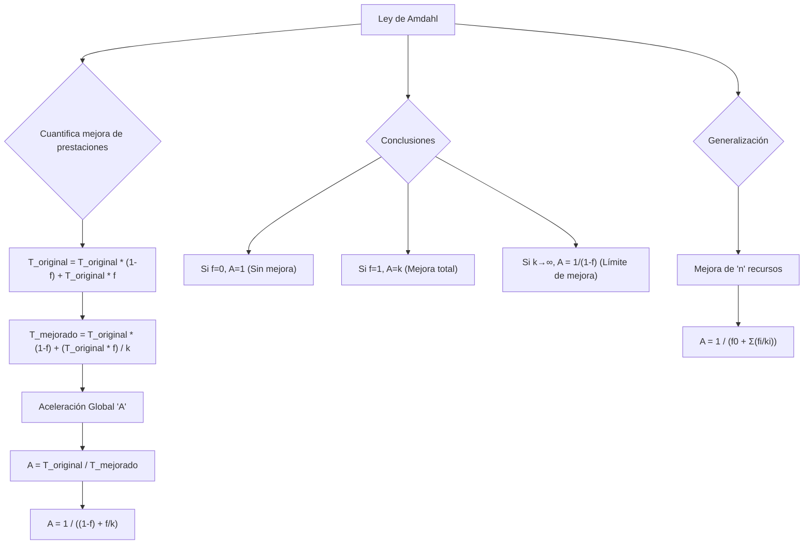

### La ley de Amdahl

Esta ley acota, de una manera muy sencilla, el incremento de prestaciones obtenido en un sistema como consecuencia de la mejora de una o varias partes del mismo.

Consideremos, para simplificar nuestro planteamiento, un computador que tarda un tiempo Toriginal en ejecutar una determinada aplicación, y que nuestro objetivo es reducir este tiempo de ejecución mejorando una de las partes del computador. Supongamos que durante una fracción *f* del tiempo original el programa hace uso exclusivo de un recurso del sistema (por ejemplo, el procesador). En consecuencia, podemos expresar Toriginal como la suma de dos componentes disjuntos: uno en el que no se utiliza este componente más otro en el que sí se utiliza:

Toriginal=Toriginal1-f+Toriginal∙f

![][image122]

El nuevo tiempo de ejecución Tmejorado que se obtendrá después de mejorar k veces el recurso afectado puede calcularse teniendo en cuenta que el segundo sumando de la expresión anterior se reducirá en un factor de k***:***  
Tmejorado=Toriginal×(1-f)+Toriginal∙fk

Donde se puede notar que el incremento de prestaciones conseguido con la mejora del recurso depende de la fracción de tiempo en que se emplea. Si dividimos ahora el tiempo original entre el tiempo mejorado obtendremos la cuantificación de la mejora de prestaciones global A obtenida (aceleración).   
A=11-f+fk

La expresión anterior recibe el nombre de ley de Amdahl (que se utiliza para justificar el upgrading del sistema) donde *f* es la proporción en la que el componente está siendo utilizado por la carga y k es el factor de mejora que se introduce mejorando esa carga. De aquí se pueden tomar ciertas conclusiones:

* Si f=0, entonces A=1. Es decir, cuando la fracción de tiempo en la que se utiliza el componente es nula, no existe aceleración.  
* Si f=1, entonces A=k. Es decir, la aceleración obtenida en el sistema global será equivalente al factor de mejora del componente si éste se utiliza durante todo el tiempo.   
* Cuando k→∞, es decir que el factor de mejora se hace muy grande, se tiene: 

A \=11-f+fk \=11-f

Que deja en claro que, independientemente de la mejora llevada a cabo en un sistema, el incremento de prestaciones global está limitado intrínsecamente por las operaciones que no están afectadas por esta mejora. 

En la obtención de A podemos despejar el Tmejorado, obteniendo

Tmejorado=ToriginalA

La aceleración A esta en veces, por lo que es más cómodo calcular en tiempo (Tmejorado)

También es posible, conocidas k y A, calcular la fracción de tiempo f. La expresión que relaciona estas variables, obtenida de la anterior, es la siguiente:

f=k×(A-1)A×(k-1)

La ley de Amdahl puede generalizarse fácilmente al caso en que se lleven a cabo mejoras sobre más de un recurso. En efecto, si se mejoran n recursos del sistema en factores k1, k2, …, kn, y cada uno de ellos se utiliza de manera exclusiva durante las fracciones de tiempo f1, f2, …, fn, respectivamente, la mejora global o aceleración obtenida se puede expresar:   
A=1f0+i=1nfiki	Con 	f0=1-i=1nfi

Las ecuaciones anteriores muestran de manera directa que una mejora es más efectiva cuanto mayor es la fracción de tiempo en que se aplica. 