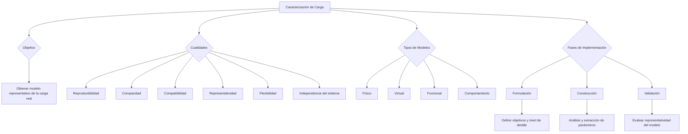

### REPASO de carga

Una carga está completamente caracterizada sí y sólo sí su resultado es un conjunto de parámetros cuantitativos seleccionados de acuerdo con los objetivos de operación de caracterización.

**Cualidades:** reproductibilidad, compacidad, compatibilidad, representatividad, flexibilidad, independencia del sistema

Se caracteriza la carga para obtener un modelo que represente la carga real y de allí poder hacerle pruebas.

* **Carga de prueba o test**: Carga que se puede utilizar cuando se está realizando un experimento de medición dado.  
* **Sesión de medida:** Intervalo de tiempo durante el que se observa el experimento (segundos, minutos, horas, etc.)

**En función del modelo que se tenga se deberá caracterizar la carga puede ser:**

* **Físico:** se basa en los consumos absolutos o unitarios de los recursos de hw y sw. (tiempo de CPU, tiempo total de E/S consumido, espacio en memoria p-s). Depende fuertemente del sistema empleado. Los parámetros usados están recopilados en logging o accounting del S.O.  
* **Virtual**: Se basa en el uso de recursos del sistema a nivel lógico (número de sentencias de cada tipo de lenguaje de alto nivel, acceso lógico a BD) Programador. Son parámetros difíciles de obtener.  
* **Funcional**: En el modelo de carga deben aparecer las aplicaciones (programas) que efectúen las mismas funciones que en la carga original con las mismas proporciones.  
* **Comportamiento**: tiempo medio de respuesta, productividad

### Técnicas de implementación de los modelos de carga

Las operaciones para implantar modelos de la carga p**ueden agruparse en tres fases:**

* **Formulación o especificación →** Secuencia de decisiones que se pretenden tomar, influenciadas por los objetivos de estudio. La definición de los componentes básicos de la carga, es decir, la identificación del menor nivel de detalle que debe modelarse y del conjunto de parámetros que debe usarse. El componente básico de la carga es la menor unidad de trabajo que se considerará (cuánto más alto es el nivel de componente básico, menor es el detalle que describe la carga), y por consiguiente, influirá en la selección de los parámetros que deben utilizarse para la descripción cuantitativa. 

Otro factor que influye en la selección de parámetros es su disponibilidad. Así pues, los parámetros que debe utilizarse para caracterizar la carga se seleccionan basándose:

* Nivel de detalle del modelo, después de estudiar sus objetivos.  
  * Verificar la disponibilidad.

* **Construcción**  
  * Análisis de parámetros: Se comienza realizando la operación de medida sobre el sistema y da como resultado un conjunto de datos considerablemente grande, por eso se agrupa en conjuntos de componentes que tienen características similares.  
  * Extracción de valores representativos: se utilizan técnicas estadísticas. Cuyo resultado es la determinación de las características de las clases componentes del modelo.  
  * Asignación de valores a los componentes del modelo: Trata de la transformación de los valores representativos en componentes ejecutables. El número de componentes que constituirán el modelo influye directamente en su representatividad e indirectamente en su capacidad.  
  * Reconstrucción de mezclas de componentes significativos: El objetivo consiste en reproducir en el modelo situaciones similares a las que se producirían en el modelo real.

* **Validación →** La evaluación del criterio de representatividad del modelo, basado en los objetivos del estudio definidos en la fase de formulación, debe efectuarse en la fase de validación para establecer la validez del modelo implementado. En esta fase no sólo se evaluará la representatividad del modelo con el conjunto de parámetros determinado que se considera, sino que se deberán realizar experimentos para determinar el dominio de validez del modelo. La validación del modelo deberá efectuarse comparando su comportamiento con el de la carga real en aquellos puntos en que se conozca por haberse efectuado algún tipo de medición. 