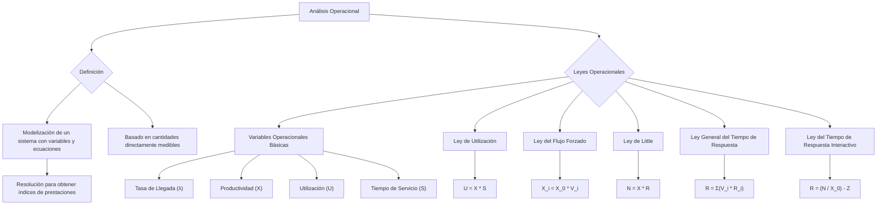

### Análisis operacional (Técnicas analíticas)

El análisis operacional forma parte de una serie de técnicas, denominadas analíticas, empleadas en la estimación del rendimiento de los sistemas informáticos. Estas técnicas hacen uso de un modelo de comportamiento del computador y su carga, y calculan los índices de prestaciones a partir de este modelo.

Es la modelización de un sistema mediante un conjunto de variables y ecuaciones, cuya resolución permite obtener índices de prestaciones a partir de un modelo de colas.

En este contexto, la palabra ***operacional*** equivale a ''directamente medible". Así una hipótesis operacionalmente comprobable es una hipótesis que puede ser verificada por medidas.

#### ***Leyes Operacionales***

##### **Variables operacionales básicas**

Las variables operacionales son cantidades directamente medibles durante un periodo de observación finito. 

Sobre un dispositivo cualquiera i de un sistema informático definimos:

* T: periodo de observación  
* Ai: número de arribos durante T  
* Ci: número de trabajos completados durante T  
* Bi: tiempo en el que el dispositivo i está ocupado.

De estas magnitudes operacionales podemos derivar las siguientes:

| Nombre | Ecuación | Unidad | Detalle |
| :---: | :---: | :---: | ----- |
| **Tasa de llegada** | i=Ai/T  | Trabajos por unidad de tiempo | Indica cuántos trabajos llegan por unidad de tiempo. |
| **Tasa de Productividad** | Xi=Ci/T  | Trabajos por unidad de tiempo | Productividad se refiere a la cantidad de trabajos completados por unidad de tiempo. |
| **Factor de utilización** | Ui=Bi/T | Adimensional | Es el tiempo en el que el dispositivo fue usado sobre el tiempo total.  |
| **Tiempo de servicio** | Si=Bi/Ci | Unidades de tiempo por trabajo | Refiere a cuánto tiempo presta ese dispositivo a los trabajos (cuanto tiempo lo usó) |
| **Tiempo entre llegadas** | 1/i=T/Ai | Tiempo | Refiere al intervalo de tiempo que llegan los trabajos. |
| **Tasa de servicio** | µi= Ci/Bi=1/Si | Adimensional | Trabajos completados sobre su utilización  (tiempo de uso del dispositivo) |

Las variables operacionales pueden cambiar de valor de un periodo de observación a otro. Sin embargo, hay relaciones que se mantienen para cualquier periodo de observación.

Estas relaciones se denominan leyes operacionales, y no dependen de hipótesis sobre la distribución estadística que siga los tiempos de servicio y los tiempos entre llegadas. 

Como punto de partida supondremos que durante el periodo de observación T el sistema se encuentra operando en un estado estable o de equilibrio, lo que recibe el nombre de **hipótesis del flujo equilibrado de trabajos**. En este estado se cumple que el número de trabajos que entra es igual al número de trabajos que sale. Esto se obtiene tomando un tiempo T lo suficientemente grande. 

Nótese que Ai \= Ci implica λ=Xi***.*** Esta hipótesis operacional, comprobable por medida, nos será muy útil de ahora en adelante.

*NOTA: las leyes no hace falta saberlas de memoria.*

##### **Ley de la utilización**

La utilización de un dispositivo se puede expresar en función del número de terminaciones mediante la siguiente fórmula:

Ui=BiT=CiTBiCi=XiSi

Si además se cumple la hipótesis del flujo equilibrado de trabajos obtendremos una expresión equivalente a la anterior en función de la tasa de llegada

Ui=iSi

##### **Ley del flujo forzado**

Esta ley es de gran importancia y relaciona la productividad del sistema X0 con la productividad de un dispositivo individual Xi***.*** En un **modelo abierto** (existencia, de, al menos, una fuente de trabajos y uno o más sumideros y, así mismo, la posibilidad de encontrar al menos un camino que a partir de cada nodo lleve a un sumidero. Sistemas transaccionales) la productividad está definida por el número de trabajos que abandona el sistema por unidad de tiempo. En cambio, en un **modelo cerrado** (los trabajos ni entran ni salen y, por tanto, su número permanece constante. Sistemas batch), ningún trabajo abandona el sistema. Aun así, los trabajos que atraviesan el enlace que une la salida con la entrada se comportan como si abandonaran el sistema e inmediatamente re-entraran en él. La productividad del sistema en este último caso viene dada por el número de trabajos que atraviesan este enlace por unidad de tiempo.

Supongamos que cada trabajo realiza Vi peticiones o visitas al dispositivo i***.*** Si el flujo de trabajos está equilibrado, el número de trabajos que sale del sistema C0 (O atraviesa el enlace exterior) y el número de trabajos que atraviesa el dispositivo i están relacionados por la expresión:

Ci=C0Vi	Y, por tanto,	Vi=Ci/C0

La variable Vi recibe el nombre de razón de visitas al dispositivo i***.*** La productividad total del sistema X0 durante el periodo de observación es:  
X0=C0T

Mientras que la productividad del dispositivo i es:

Xi=CiT=CiC0C0T

En consecuencia, podemos obtener una expresión de Xi, en función de las variables Vi y X0:  
Xi=X0Vi

Que représente la expresión de la ley del flujo forzado. Esta ley establece que el flujo a través de un determinado dispositivo de la red determina el flujo en cualquier otro dispositivo. La ley del flujo forzado es válida si lo es la hipótesis del flujo equilibrado de trabajos.

Combinando los resultados de la ley del flujo forzado y de la ley de la utilización podemos obtener la siguiente expresión para el valor de la utilización del dispositivo:

Ui=XiSi=X0ViSi=X0Di

Donde Di \= ViSi recibe el nombre de **demanda de servicio** sobre el dispositivo i en todas las visitas que un trabajo realiza al mismo. La relación anterior establece que la utilización de cada dispositivo del sistema es proporcional a su demanda de servicio.

Otra descripción equivalente se puede realizar mediante la proporción de trabajos, también denominada probabilidad de encaminamiento o de transición. Así las probabilidades de encaminamiento, pij***,*** indican la proporción de trabajos que cuando salen de la estación i se dirigen a la estación j***,*** o de forma equivalente, indican la probabilidad de que un trabajo pase a la estación j después de terminar su servicio en la estación i***.*** En este sentido se tendrá que pij \= Cij/Ci y en particular, p0j \= A0j/A0 y pi0 \= Ci0/C0***.***

Razones de visita y probabilidades de encaminamiento son equivalentes en el sentido de que a partir de una se obtienen las otras. En un sistema con K estaciones de servicio en que se cumple la hipótesis del flujo equilibrado de trabajos se tiene:  
Cj=i=0KCipij

Donde el subíndice 0 representa el exterior del sistema y pi0 es la proporción de trabajos que, después de recibir servicio en la estación i*,* abandonen la red. Dividiendo ambos lados de la igualdad por C0 obtenemos:  
Vj=i=0KVipij

Que representan las denominadas ecuaciones de las razones de visita. Como cada visita al mundo exterior corresponde a una terminación de un trabajo, tendremos que siempre se cumplirá V0=1.

##### **Ley de Little**

La única hipótesis requerida para su aplicación es la del flujo equilibrado de trabajos. Si llamamos Ni al número de trabajos y Ri al tiempo de respuesta de la estación de servicio i*,* la ley de Little establece que:  
Ni=iRi

Y como hemos exigido que se cumpla la hipótesis del flujo equilibrado de trabajos podemos sustituir i por Xi.  
Ni=XiRi

**La ley de Little se puede utilizar en sistemas interactivos**. 

##### **Ley general del tiempo de respuesta** 

El número de trabajos en una red de colas formada por K estaciones se puede expresar como N \= N1 \+ N2 \+ … \+ NK**.** Si sustituimos los valores de Ni, de acuerdo con la ley de Little tendremos:   
X0×R=X1R1+X2R2+…+XKRK=i=1KXiRi

Dividiendo ambos miembros de la igualdad por X0 y aplicando la ley del flujo forzado quedará la expresión:  
R=V1R1+V2R2+…+VKRK=i=1KViRi

Esta expresión recibe el nombre de ley general del tiempo de respuesta, y permite ver claramente que el tiempo de permanencia de un trabajo en un sistema depende del número de visitas que realiza a cada dispositivo y del tiempo de respuesta que experimenta en él por cada una de las visitas.

##### **Ley del tiempo de respuesta interactivo**

Todos los modelos de sistemas con carga interactiva pueden dividirse conceptualmente en dos partes: una que modela el tiempo de reflexión (subsistema de terminales) y otra que contiene los dispositivos físicos del computador contemplados por el modelo (subsistema central). El tiempo de reflexión ***(think time),*** identificado habitualmente mediante la variable Z*,* es el tiempo que transcurre desde que un trabajo abandona el subsistema central hasta que entra de nuevo en él.   
El tiempo de respuesta del sistema, R, corresponderá al tiempo que un trabajo pasa en el subsistema central.  
El funcionamiento del sistema es el que sigue: los usuarios generan peticiones desde los terminales que se sirven en el subsistema central, y vuelven posteriormente a los terminales. Estos terminales están modelados por una estación con infinitos servidores (no hay tiempo de espera en cola). Transcurrido el tiempo de reflexión los usuarios generan la siguiente petición.  
![][image126]  
Podemos aplicar la ley de Little al conjunto de los dos subsistemas. Este conjunto incluye el subsistema central y el subsistema de terminales. El número de trabajos en el conjunto es N***.*** El tiempo medio que permanece un trabajo en el conjunto es igual al tiempo que permanece en los terminales, Z***,*** más el tiempo que permanece en el subsistema central, R***.*** Por tanto, aplicando la ley de Little, se puede escribir:  
N=Z+RX0

Y despejando la variable R obtenemos la expresión para la ley del tiempo de respuesta interactivo:  
R=NX0-Z

Nótese que el número de trabajos en los terminales viene dado, empleando la ley de Little, por Z×X0 y el número de trabajos dentro del sistema que compiten por los recursos es R×X0 