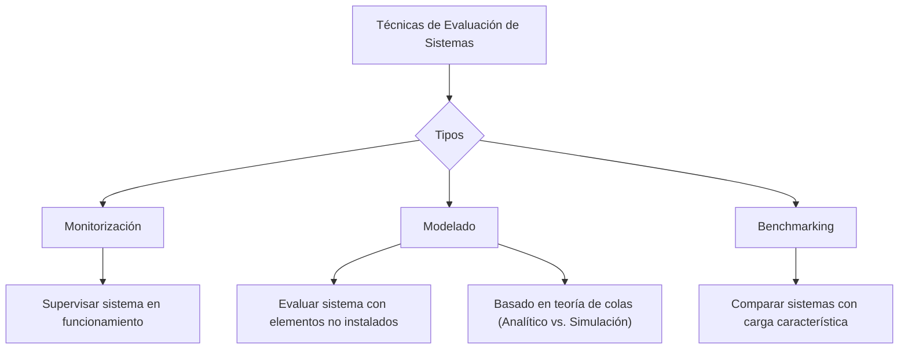

### Técnicas de evaluación de sistemas

Se denominan técnicas de evaluación a los métodos y herramientas que permiten **obtener los índices de prestaciones** de un sistema que está ejecutando una carga dada y con unos valores determinados de parámetros del sistema.

Las técnicas pueden ser de tres tipos: 

* Monitorización  
* Modelado  
* Benchmarking

#### ***Monitorización***

La **monitorización** es una técnica de uso generalizado para supervisar, analizar y evaluar el comportamiento, y el rendimiento de los sistemas informáticos, que están en funcionamiento. **Es decir, es la técnica que permite observar la actividad de un sistema mientras es utilizado por los usuarios.** 

Los **monitores** son las herramientas de medición que permiten seguir el comportamiento de los principales elementos de un sistema informático cuando éste se halla sometido a una carga de trabajo determinada. Aunque su objetivo es la medición de las prestaciones, se les denomina monitores ya que, debido a la imposibilidad de reproducir situaciones con la carga real, estos instrumentos hacen un seguimiento de lo que sucede en el sistema, es decir, lo monitorizan.

* Hace un seguimiento (NO una medición, captura datos de la actividad del sistema)  
* Tienen como objetivo cuantificar los resultados de una observación.  
* Al administrador la información aportada por el monitoreo le es útil para:  
  * Conocer la utilización de los recursos del sistema y los cuellos de botella  
  * Ajustar los parámetros del sistema y mejorar sus prestaciones

Aparte de su utilización directa para tomar medidas de un sistema existente, permiten determinar la aproximación de una carga de *benchmark* a la carga real, obtener datos para la construcción de modelos y su validación posterior, etc.

Estas herramientas son imprescindibles para evaluar el comportamiento de un sistema existente, a pesar de las **perturbaciones** que pueden introducir en el sistema cuyo comportamiento se va a evaluar.

#### ***Modelado***

Es la técnica que se debe utilizar cuando se trata de **evaluar el comportamiento de un sistema en el que hay algún elemento (hardware o software) que no está instalado.** 

En general, *se fundamentan en la teoría de colas,* pudiéndose considerar las colas o bien de forma individual o bien unidas formando redes abiertas o cerradas. Su tratamiento se puede realizar mediante los métodos analíticos que proporcionan las teorías de colas y de redes de colas, o por medio de la simulación

Las técnicas de simulación consisten en la construcción de un programa que reproduce el comportamiento temporal del sistema, basándose en sus estados y sus transiciones. **Los resultados se obtienen por extracción de estadísticas del comportamiento simulado del sistema**. Las técnicas analíticas se basan en la resolución mediante fórmulas cerradas o algoritmos aproximados de las ecuaciones matemáticas que representan el equilibrio que existe entre los eventos o transiciones de estado discontinuas que se producen en el sistema.

**La limitación de los métodos analíticos es su incapacidad para tratar determinadas estructuras y comportamientos** de las colas que existen en los sistemas informáticos. **Los métodos de simulación** **no tienen estas limitaciones, pero, en general, son mucho más caros** que los analíticos tanto en tiempo de cálculo como en esfuerzo de puesta a punto.

No obstante, la principal dificultad de esta herramienta reside en la obtención de datos lo suficientemente precisos para ejecutar el modelo y obtener resultados con el grado de aproximación que se exige.

#### ***Benchmarking***

Es un método de **comparar sistemas informáticos frente a una carga característica de una instalación concreta**, efectuándose la comparación, básicamente, a partir del tiempo necesario para su ejecución. Generalizando se puede considerar como la medición del comportamiento sobre un prototipo. Variantes de este método se usan para evaluar la potencia relativa de un sistema a lo largo de su ciclo de vida, para contrastar monitores y para validar modelos. 

BENCHMARKING  MEDICIÓN

La finalidad es analizar el rendimiento del sistema poniendo énfasis en la carga de trabajo, hay una **comparación,** en la medición solo se recolectan los datos.

Las **principales dificultades** que se plantean son:

* Cómo determinar esa carga característica, de forma que sea suficientemente reducida para ser manejable y suficientemente extensa para ser representativa.  
* Cómo valorar el aprovechamiento que hacen los programas de las peculiaridades de los distintos sistemas.

**Resultado de un benchmarking**

* Es un número o conjunto de números, que representa el grado de ajuste del equipo a las exigencias de la carga. Es decir, en cuanto se acerca al rendimiento aceptable.  
* Las unidades dependen totalmente del objetivo del estudio y de qué nivel del sistema informático interese medir.  
* Por ejemplo: número de programas o usuarios concurrentes que le SO es capaz de soportar.  
* Así el equipo que corriendo la carga testigo obtenga la mejor performance (menor tiempo de respuesta, menor porcentaje de utilización de recursos) será el más conveniente.

**Utilidad de benchmarking**

* Nutre al proceso de provisión para evaluar equipos  
* El mismo seguimiento se puede utilizar para hacer la sintonización  
* Sirve al subsistema de aplicación para analizar las prestaciones 