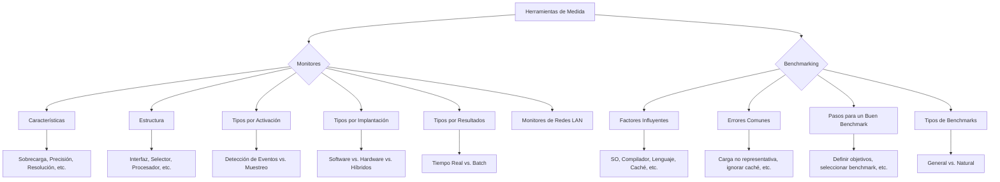

### Herramientas de medida

#### ***Monitores***

La herramienta del monitoreo es el **monitor**, que observa el sistema, recolecta los datos estadísticos de la ejecución de los programas, analiza los datos obtenidos y presenta resultados. Sus características de calidad son las mismas que las de los instrumentos de medición.

Una característica de una medida debe ser su **repetibilidad,** esto es, la posibilidad de realizar una medición diferentes veces, y que el resultado de este proceso (la medida) sea siempre el mismo.  

Ahora bien, en informática, el resultado de una medición será distinto unas veces de otras, ya que, normalmente, no es posible repetir las mismas condiciones de carga y en los mismos instantes. Por ello, se habla de monitorización y no de medición ya que lo que estrictamente se efectúa es un **seguimiento** de la actividad realizada **(seguimiento, no medición)**.

**Tienen como objetivo cuantificar los resultados de una observación.**

Pueden ser utilizados para:

* Conocer la utilización de los recursos del sistema y los cuellos de botella  
* Para el programador, puede encontrar los segmentos de código más utilizados y mejorarlos.  
* Ajustar los parámetros del sistema en vistas de mejorar las prestaciones  
* Un analista de sistemas puede caracterizar la carga y crear cargas de prueba, cuyos resultados se pueden utilizar para planificar la carga del sistema.

##### **Características del monitor**

Los monitores definen sus características en función de las mismas que los instrumentos de medición, que son, a saber:

* **Sobrecarga o interferencia**: Como sustraen energía al sistema observado, esta debe ser tan poca que no altere los resultados de la observación. En los monitores HW se da en los puntos de conexión, y en los de SW se da por el aumento que producen en la carga del sistema.  
* **Precisión**: Se expresa por el error que puede afectar el valor de los datos obtenidos, por interferencia del propio monitor, incorrecta instalación o utilización, dígitos para representar la medición.  
* **Resolución**: Máxima frecuencia a la que puede detectarse y registrar correctamente los datos. Capacidad de separar dos eventos consecutivos en el tiempo.  
* **Ámbito o dominio de la medida**: Tipo de acontecimientos que puede registrar y características que es capaz de observar y medir.  
* **Anchura de entrada**: Máximo de bits de información de entrada que puede extraer y procesar en paralelo cuando sucede un acontecimiento.  
* **Capacidad de reducción de datos**: Capacidad de analizar, procesar y empaquetar datos para mejor comprensión y reducción de espacio de almacenamiento.  
* **Compatibilidad**: El HW y el SW de monitorización deben ser fácilmente adaptables a cualquier requerimiento de aplicación.  
* **Coste**: Considerar el coste de adquisición, los de instalación, mantenimiento, formación y operación.  
* **Facilidad de instalación**: Del monitor, así como también la facilidad de retirarlo del sistema.  
* **Facilidad de utilización**: Deben ofrecer al usuario una interfaz que pueda ser utilizada por cualquier programador.

##### **Estructura del monitor**

| Sistema a medir | La conexión entre el monitor y el sistema se realiza a través de la interfaz de instrumentación. |
| :---: | :---- |
| **Interfaz de instrumentación** | Contiene todos los elementos que permiten acceder a los puntos del sistema que contiene información relevante para el monitor. |
| **Selector de filtro** | Permite una captura selectiva de las actividades sondeadas. También genera aquellas variables que no son directamente observadas por el sistema a partir de las variables observadas. |
| **Procesador** | Comprueba los elementos del sistema a ser analizados |
| **Registrador** | El resultado se graba en un medio de almacenamiento para poder ser analizados e interpretados y así obtener los resultados deseados. |
| **Analizador** | Algunas veces se analiza con la detección y captura de eventos (tiempo real), otra se hace después de la recogida de toda la información (análisis diferido) |

##### **Tipos de monitores**

**Según su mecanismo de activación**

Hay diversas técnicas para medir (observar) un sistema informático; su elección depende del tipo de análisis que deba efectuarse y del nivel al que deba realizarse.

* ***Detección de acontecimientos (Eventos):*** Se define un acontecimiento como un cambio de estado del sistema. El principio de detección de acontecimientos software es el de insertar un código suplementario *(**traps**,* es decir, interrupciones controladas por el programa) en lugares determinados del sistema operativo. Cuando se produce un acontecimiento que debe detectarse, este código transferirá el control a la rutina de tratamiento, que almacenará sus datos significativos, junto con el instante de aparición. Esta técnica se deberá utilizar sólo cuando sea necesario conocer la secuencia de estos acontecimientos o el número de veces que se han producido en un intervalo determinado.  
* ***Periodos de tiempo (Muestreo):*** es una técnica estadística que se puede usar siempre que el conocimiento de todos los componentes, objetos o acontecimientos de una población sea imposible, poco práctica o demasiado cara. Entonces, en vez de examinar todos los elementos de la población completa, este método **analiza solamente una parte de ellos, denominada una muestra**. Estos monitores se activan a intervalos de tiempo fijos o aleatorios mediante interrupciones de reloj. El muestreo puede usarse con dos objetivos distintos:   
  * Evaluar las fracciones de un intervalo de tiempo dado que cada componente del sistema ha permanecido en distintos estados.   
  * Seguir la evolución de un sistema y predecir su comportamiento futuro de forma que puedan tomarse las decisiones que tendrán una influencia positiva en su comportamiento.

**Según su implantación**

* ***Monitores software**,* que son **programas o ampliaciones del sistema operativo** que acceden al estado del sistema, informando al usuario (ya sea de forma continua, o cuando éste lo requiere) sobre dicho estado. Son, sobre todo, adecuados para monitorizar los sistemas operativos, las redes y las bases de datos, así como las aplicaciones que las utilizan.  
* ***Monitores hardware**,* que son dispositivos electrónicos que se conectan a determinados puntos del sistema, donde se encargan de detectar determinados niveles o señales eléctricas que caracterizan la evolución del sistema.  
* ***Monitores híbridos**,* que son una combinación de las dos técnicas anteriores, intentando combinar las ventajas de una y otra

![][image127]

| Característica | Monitor Hardware | Monitor software | Monitores híbridos |
| :---- | :---: | :---: | :---: |
| **Dominio de medición** | Bajo nivel (fijo) | Alto nivel | Todos |
| **Resolución** | Alta (fija) | Baja (variable) | Alta |
| **Anchura** | Finita | Infinita | Infinita |
| **Interferencia** | Baja | Alta | Media |
| **Coste** | Alto | Bajo | Alto |
| **Reducción** | No | Si | No/Sí |
| **Portabilidad** | Sí | No | No |

|  DETALLE | Monitores |  |
| :---: | ----- | ----- |
|  | **Software** | **Hardware** |
| **Dominio de medición** | \-Acceso controlado mediante alguna instrucción de máquina. \-Puede elegir qué datos deben ser accedidos o controlados | \-Tiene acceso a la información solo cuando entra o sale de la memoria. \-Es un observador pasivo. |
| **Resolución** | \-Frecuencias elevadas, determinada por la velocidad de las sondas y lógica del monitor. | \-Condicionado a la ejecución de la instrucción, se debe tener en consideración las instrucciones necesarias del monitor. \-Puede parar el sistema y analizar los acontecimientos, pero puede provocar una distorsión en el funcionamiento del sistema. |
| **Interferencia** | \-No produce interferencia, si las sondas han sido elegidas correctamente | \-Provoca perturbación en el sistema observado, ya que utiliza los propios recursos del sistema. |
| **Anchura de entrada** | \-Puede detectar los acontecimientos sólo secuencialmente. \-Anchura, teóricamente, ilimitada, con la perturbación del Overhead introducido | \-Permite la detección de acontecimientos en paralelo. \-Anchura limitada por el número de sondas disponibles |
| **Facilidad de uso** | \-Al ser una extensión de SO, es más fácil utilizarlo | \-Requiere un mayor grado de especialización y conocimiento |
| **Costo** | \-Accesible (instalación y funcionamiento) | \-Costoso (instalación y funcionamiento) |

**Según su forma de mostrar los resultados**

* ***Monitores en tiempo real,*** que constan de un módulo analizador que procesa los datos recogidos a medida que los recibe. En consecuencia, el módulo de proceso debe ejecutarse de forma continua, o con gran frecuencia, para poder presentar resultados parciales al analizador que informará de la evolución del sistema.   
* ***Monitores batch**,* que difieren de los anteriores en que primero se recoge la totalidad de la información y, una vez terminado el período de recolección, se procesa dicha información.

##### **Monitores de redes LAN**

La monitorización de una red es esencial para administrarse bien ya que proporciona todos los datos necesarios para caracterizar o estudiar prestaciones.

*Los dominios de administración de LAN que define la OSI son:*

* **Manejo de fallos**: esfuerzo para minimizar el tiempo medio requerido para detectar y reparar un problema en la red.  
* **Administración de cuentas**: se lleva a cabo mediante un tipo de monitor conocido como monitor de contabilidad, que informa de los recursos utilizados por los usuarios del sistema con el fine, entre otras cosas, de proceder a la facturación de recursos.  
* **Manejo de configuraciones:** esfuerzo para definir y monitorizar las configuraciones física y lógica de la red.  
* **Manejo de las prestaciones:** esfuerzo para mejorar las prestaciones de la red y detectar prestaciones degradadas por colección y análisis de estadísticas de la red, y modificación de parámetros apropiados de la red.  
* **Manejo del control de acceso**

 *Características de los monitores LAN:*

* **Interferencia:** Corresponde a la interferencia producida en el sistema por la introducción de un dispositivo monitor.  
* **Generación de tráfico artificial:**  pueden ser usados para emular condiciones de altas cargas, producir patrones de tráfico variable y repetitivo, y extraer información temporal.  
* **Análisis en tiempo real:** losa datos recogidos por el monitor pueden ser analizados inmediatamente o almacenados para un análisis posterior.  
* **Parámetros de interés:** la elección del tipo de monitorización puede ser muy dependiente de los parámetros que interese conocer de la red.

#### ***Benchmarking***

Se denomina Benchmark a los programas (kernels, programas sintéticos y de nivel aplicación) utilizados en el benchmarking (objeto estacionario). 

**El resultado del benchmarking es un número o conjunto de números, que representa el grado de ajuste que requiere ese equipo a las exigencias de la carga**. Las unidades dependen totalmente del objetivo del estudio y de qué nivel del sistema informático interese medir. *Por ejemplo: número de programas o usuarios concurrentes que un sistema operativo es capaz de soportar.*

Así, el equipo que corriendo la carga testigo obtenga la mejor performance (menor tiempo respuesta, menor porcentaje de utilización de recursos) será el más conveniente.

##### **Factores que influyen en benchmarking**

* **El rendimiento puede depender del tipo y versión del sistema operativo que tenga instalado el sistema estudiado:** una forma idóna de realizar las pruebas de medida consiste en usar en los distintos sistemas que se van a comparar la misma copia de sistema operativo; se aconseja que las características y parámetros de los sistemas operativos sean los más parecidos posible.  
* **El compilador** usado en la prueba es realmente un elemento determinante del rendimiento obtenido en el sistema, ya que según la facilidad que tenga el compilador en generar el código eficiente, el modelo de carga se ejecutará más o menos rápidamente. Además del nivel de optimización que se esté usando.  
* **Los lenguajes de programación** influyen sobre los tests realizados con benchmarks, ya que tienen facilidades diferentes en secuencias de llamadas, punteros, manejo de tiras de caracteres, etc., que repercuten directamente sobre los tiempos de ejecución, aunque los algoritmos parezcan similares.  
* **El sistema de librerías de ejecución**, ya que, según sean éstas, las funciones que implantan serán más eficientes, disminuyendo el tiempo de ejecución. Esto debe tenerse en cuenta sobre todo cuando el usuario necesita una buena precisión y, por lo tanto, es necesario saber qué tipo de librería se ha usado en la prueba.  
* **El tamaño de la memoria caché** es un factor importante porque los tiempos de ejecución varían notablemente dependiendo de si el programa cabe entero en la cache o si no cabe y debe acceder a la memoria principales.  
* **Es conveniente que programas usados como modelo de carga realicen una verificación de resultados obtenidos,** para que el usuario sepa que el benchmark se ha ejecutado correctamente.

##### **Errores comunes en el benchmarking**

* **Representar en la carga de test sólo los comportamientos medios:** las cargas de test o de prueba se diseñan para que sean representativas de la carga real. Los diseñadores de carga se aseguran de que la demanda relativa de recursos sea similar a la observada en el entorno real. Estos valores constantes no son deseables ya que pueden causar sincronizaciones llevando a conclusiones erróneas. En estas ocasiones, es necesario ir a una representación más detallada de recursos.  
* **Controlar de manera inadecuada el nivel de carga.** La carga de test dispone de varios parámetros que se pueden modificar para incrementar el nivel de carga en el sistema.  
* **Ignorar los efectos de la caché.** Las memorias caches son muy sensibles al orden de las peticiones. En los sistemas modernos se emplean las caches en los accesos de memoria, a los discos, a las redes, por tal motivo, cada vez es más necesario modelar de manera precisa el orden de las llegadas.  
* **Ignorar el overhead del monitor.** Los mecanismos de recolección de datos o los monitores software que se utilizan en las medidas presentan un overhead que introduce error en los valores medidos.  
* **No validar las medidas.** Es un error bastante común, cualquier error cometido en el experimento de medida puede pasar totalmente desapercibido.  
* **No asegurar las mismas condiciones iniciales.** Cada ejecución del benchmark altera el estado del sistema.  
* **No medir las prestaciones del transitorio**. Durante las medidas, se permite al sistema alcanzar el estado estable antes de tomar las medidas. Al sistema le cuesta un largo período de tiempo alcanzar el estado estable puede ocurrir que el sistema esté más tiempo en estado transitorio que en estado estable. Sería más realista estudiar las prestaciones en el transitorio.  
* **Usar las utilizaciones de los dispositivos para comparar las prestaciones.** Las utilizaciones de los dispositivos son índices de prestaciones en el sentido que, dada la misma carga, es preferible la utilización menor, emplearlas para comparar dos sistemas puede ser no adecuado. Utilizaciones menores para el mismo número de usuarios no deberían interpretarse como mejores prestaciones. El índice adecuado para comparar dos sistemas en este caso sería la productividad expresada en peticiones por segundo.  
* **Recoger muchos datos para realizar poco análisis**. El análisis de datos no suele recibir la atención adecuada por varias razones, puede suceder porque la persona que realiza las medidas no suele tener demasiada práctica en la utilización de técnicas estadísticas. O porque la toma de datos suele ocupar tanto tiempo del proyecto que ya no queda para el análisis.

##### **Pasos para conseguir un buen paquete de programas benchmark**

* Determinar que se quiere estudiar y porqué (objetivo).  
* Seleccionar en benchmark sobre la base del objetivo definido (características: representatividad, reproducibilidad, compacidad, escalabilidad).  
* Se deben **comprobar** los **aspectos** del sistema bajo estudio **que influyen en el rendimiento**, como pueden ser el sistema operativo, los compiladores y su nivel de optimización, el uso de memorias caché, etc.  Además, se debe comprobar que los programas, versiones y datos usados como *benchmark* sean los mismos en todas las pruebas. Todo esto es fundamental para que las comparaciones tengan significado.  
* Finalmente, obtenidos los resultados y entendiendo perfectamente qué hace cada programa *benchmark,* se debe intentar **estudiar la causa que produce variaciones en los resultados de los distintos sistemas.**

##### **Tipos y necesidad de los benchmarks**

* **Benchmark general (carga artificial)** La primera definición nos dice que los *benchmarks* son una forma de evaluar las prestaciones de un sistema informático, en conjunto o sobre partes determinadas. Además, si el *benchmark* está estandarizado, los resultados se podrán comparar con los obtenidos en distintos sistemas.  
* **Benchmark natural, (carga de prueba teniendo en cuenta la carga real).** La segunda definición de *benchmark* se obtiene particularizando y creando una clasificación en la que se reparten los distintos programas usados para evaluar sistemas informáticos; en este caso los *benchmarks* se pueden definir como conjuntos de programas completos escritos en lenguaje de alto nivel extraídos de la carga real y que se consideran representativos de esta carga real.

##### **Razones para utilizar Benchmarks**

* Nutre al proceso de provisión para poder evaluar equipos (Seguimiento → provisión)  
* Sirve para saber qué ajustar para sintonizar los equipoS (Como retroalimentación a sí mismo)  
* Para poder analizar las prestaciones (Seguimiento → aplicación)