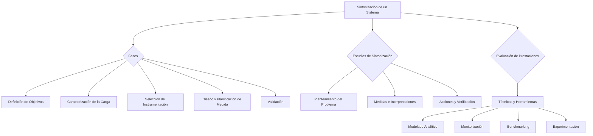

### Sintonización de un sistema

El primer paso para **mejorar las prestaciones y la eficiencia de un sistema informático** es analizar su funcionamiento. Es decir, llevar a cabo un estudio de evaluación de las prestaciones del sistema. Las operaciones que se llevarán a cabo se pueden agrupar en las siguientes **fases**: 

![][image128]

#### ***Definición de objetivos***

Hay que determinar los objetivos del estudio y el tipo de datos que se desea obtener. Se determinará el método que se utilizará para analizar las prestaciones del sistema, la cantidad de recursos que es preciso emplear y la forma de justificar la inversión necesaria.  
![][image129]

#### ***Caracterización de la carga***

Caracterizamos la carga para obtener una carga modelo (carga de prueba o test) y así realizar pruebas. Una carga está correctamente caracterizada si y sólo si, su resultado es un conjunto de parámetros cuantitativos seleccionados de acuerdo con los objetivos de operación de caracterización.

Cualidades: reproductibilidad, compacidad, compatibilidad, representatividad, flexibilidad, independencia del sistema.

#### ***Selección de la instrumentación***

Una vez definidos los objetivos del estudio, el siguiente paso será medir todo aquello que pueda tener influencia sobre los mismos. Medir implica recoger datos acerca de la actividad del sistema empleando para ello las técnicas y la instrumentación adecuada.  
![][image130]

El estudio se centra en las siguientes áreas: 

* Los componentes hardware del sistema.   
* El software del sistema (sistema operativo y los programas de sistema y de usuario)  
* La carga, es decir, el conjunto de programas que el sistema tiene que procesar durante un período dado.

#### ***Diseño y planificación de la sesión de medida***

Para poder planificar una sesión de medida debe conocerse, al menos someramente, la carga y su evolución en el tiempo. Las medidas deben llevarse a cabo en un entorno controlado con carga conocida y no se deben hacer modificaciones en el hardware ni cambios en los procedimientos habituales de operación durante su realización. 

Se deberá saber, al menos de manera aproximada, cuándo se producen los mayores incrementos de carga (picos de carga) para poder tenerlo en cuenta a la hora de planificar la sesión. Las sesiones suelen incluir medidas correspondientes a, precisamente, esos períodos de incremento de carga.

Si se utiliza un **monitor de software** se debe tener en cuenta que este también utiliza recursos.  Por tanto, habrá que seleccionar la longitud de la sesión de medida (y, por tanto, la frecuencia de muestreo) de manera que, dado un nivel de confianza, la interferencia con el sistema sea la mínima posible.

Si se utiliza un **monitor de hardware** se debe tener en cuenta la correcta conexión de sensores, la longitud de los cables, la correcta selección de las señales, etc.

#### ***Validación***

El esquema global de las operaciones implicadas en esta fase aparece en la figura. (El libro solo tiene esto).  
![][image131]

### Estudios de sintonización

**Se siguen los siguientes pasos:**

* Planteamiento del problema: Se plantean los síntomas externos de ineficiencia que han motivado el estudio, así como los objetivos que se pretenden alcanzar.   
* Medidas e interpretaciones.   
* Acciones emprendidas y verificación de sus efectos.

### Evaluación de las prestaciones del sistema informático

De acuerdo con parámetros de rendimientos aceptables según el entorno particular…

| Técnica | Herramientas | Finalidad |
| :---: | :---: | :---: |
| **Modelado-Técnicas analíticas** | Análisis Operacional | Evaluar índices. Detectar cuellos de botellas potenciales |
| **Monitorización (uso de recurso por lo general)** | Monitores | Observación y medición del sistema. Caracterización de la carga |
| **Benchmarking (uso de recurso y comportamiento)** | Benchmark Sintéticos/ artificiales | Comparación Selección, configuración |
| **Sintonización Experimentación** | HW, SO, Carga | Mejora las prestaciones del sistema actual | 