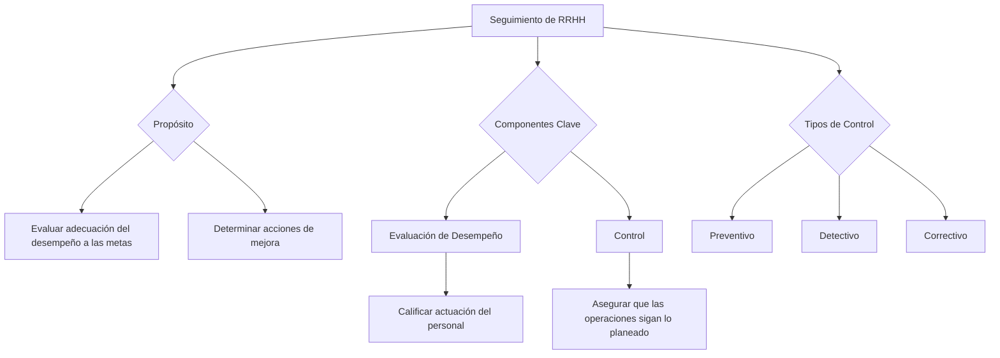

## **Seguimiento de RRHH** {#seguimiento-de-rrhh}

**Sistema de evaluación de cómo el personal está rindiendo**, de cómo se está acercando a tener lo más alto del perfil pedido y como está contribuyendo a los objetivos y metas.

Por un lado tengo el **control de desempeño** para ver como esta el personal, pero también **debo hacer una auditoría**, necesito saber como estoy llevando adelante la gestión de los RRHH (esta auditoría se hace en un área FUERA del área de la gerencia, una auditoría interna la hace el staff de RRHH, en caso de necesitar más hago una auditoría externa).

⇒ Es el subsistema conformado por los procesos, métodos y herramientas que permiten **evaluar el grado de adecuación del desempeño/rendimiento de los RRHH a las metas de funcionamiento establecidas y determinar las acciones de mejora adecuadas.**

* **Evaluación de desempeño:** es el proceso de calificar la actuación (pasada o presente) del personal (un empleado, un equipo de trabajo) en base a normas de desempeño establecidas. Su finalidad es verificar y asegurar el desempeño de las tareas. Todo, según lo que la organización se ha fijado como metas y formas de desempeño deseables.  
* El **control** trata de asegurar que las diversas unidades de la organización marchen de acuerdo con lo previsto. Es la **acción** que ajusta las operaciones a los estándares predeterminados; su base de acción es la información de retorno. El control trata de garantizar que todo ocurre de acuerdo con la planeación adoptada y los objetivos preestablecidos, señalando las fallas y los errores para corregirlos y evitar reincidir en ellos.

Hay diferentes **momentos en los que controlar,** derivando asi en **tipos de control**:

* Cuando es previo a que ocurra un hecho, que se intenta evitar, entonces el **control es preventivo**  
* Cuando los controles preventivos han fallados, primero se debe identificar el hecho antes de poder solucionarlo, allí hablamos de **control detectivo**  
* Por último se intenta restablecer el funcionamiento normal del sistema, que fue alterado por la falla detectada, esto es el **control correctivo**, realizamos acciones correctivas para restablecer el estado deseable del sistema. 