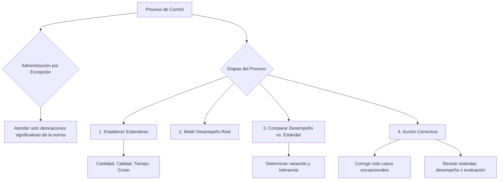

### Administración por excepción

*“Me tengo que preocupar cuando hay incidentes o situaciones imprevistas, o alejadas de la norma (superan un cierto rango de desvío).*”

Toda operación se caracteriza por experimentar variaciones; cuando estas son pequeñas y no causan distorsiones, pueden aceptarse como normales, pero cuando son muy grandes y causan tropiezos, constituyen **excepciones** que deben tratarse con cuidado y corregirse de manera adecuada.

### Etapas del proceso de control

**El proceso de control es cíclico y repetitivo**, y sirve para ajustar las operaciones a los estándares preestablecidos.

![][image132]*Chiavennato*

*![][image133]Robbins y Coulter*

#### ***Establecimiento de los estándares deseados***

Los estándares representan el desempeño deseado. Un estándar es una norma, define el nivel normal de trabajo, es decir, es un valor de referencia que indica cómo se debería trabajar **→** valor que determina el rendimiento normal, lo que es esperable y alcanzable por todos.

*estándar \<\> umbral: el umbral tiene que ser más alto.*

Los estándares representan desempeños que son significativos para cada organización en particular,  y pueden expresarse en:

* **Cantidad:** Número de empleados, Volúmenes de producción o ventas, Índice de accidentes, Índice de rotación.  
* **Calidad:** Calidad de los productos, Calidad de los servicios, Asistencia técnica, Mantenimiento de equipos.  
* **Tiempo:** tiempo estándar, tiempo medio desde el hogar, horas hombre trabajadas, ciclo de producción.  
* **Costos:** de cada orden de servicio, costo medio de selección, costo medio de entrenamiento, costo de salario indirecto.

#### ***Medición del desempeño real (Seguimiento o monitoreo del desempeño)***

![][image134]![][image135]

**Nota**: En este momento entra la evaluación de desempeño.

#### ***Comparación del desempeño con los estándares deseados***

Luego de evaluar se hace la comparación entre el **desempeño real** y el **estándar.** Toda actividad experimenta alguna variación, error o desviación. Por tanto, es importante determinar los límites en que esa variación podrá aceptarse como normal o deseable: la llamada **tolerancia**.

La comparación no sólo busca localizar errores o variaciones, sino también predecir resultados y localizar las dificultades para alcanzar mejores resultados en operaciones futuras. Sirve para saber cuánto se está alejando del desempeño real.

**Umbral de desempeño**: aquello que yo fijo que está sobre el estándar y que se lo firma en forma consciente, mediante el cual todos que cumplan, acceden a la remuneración variable que pudo haber sido establecido. Es distinto al LÍMITE SUPERIOR

![][image136]  
Se pueden observar tres casos:

* etapa 1 > etapa 2 → tengo un \- aceptable  
* etapa 1 \< etapa 2 → tengo un \+ aceptable  
* etapa 1 \= etapa 2 

⇒ Si estoy permanentemente por debajo, tengo que replantear los estándares, ya que estoy poniendo metas que requieren mucho esfuerzo y que eso me lleva a ciertos desequilibrio. Si pongo estándares muy bajitos me puede llegar a desmotivar a la gente. **El estándar refleja el rendimiento normal.**

#### ***Acción correctiva, si es necesaria***

Las variaciones, errores o desviaciones deben corregirse para que las operaciones se normalicen. La **acción correctiva** incide sólo sobre los casos excepcionales.

Con la acciones correctivas puedo notar:

* estándares poco exigentes o muy exigentes ⇒ debo revisar el estándar  
* trabajar sobre el desempeño  
* trabajar sobre la evaluación o el evaluador.

**Nota:** en esas etapas, **¿qué coincidencias tengo con la evaluación de desempeño?** Las técnicas de evaluación de desempeño las puedo aplicar en esas etapas ⇒ el control de desempeño incluye la evaluación de desempeño.  
![][image137] 