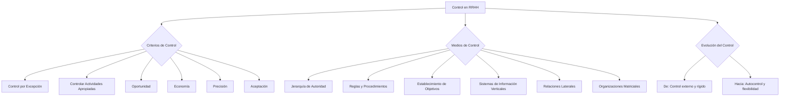

### Criterios de control

Para que el proceso de control sea eficaz, **debe atender los siguientes criterios:**

* **Controlar por excepción:** investigar situaciones que se alejan de la norma, bastante alejado de lo común.

Toda operación se caracteriza por experimentar variaciones; cuando estas son pequeñas y no causan distorsiones, pueden aceptarse como normales, pero cuando son muy grandes y causan tropiezos, constituyen excepciones que deben tratarse con cuidado y corregirse de manera adecuada → *"Me tengo que preocupar cuando hay incidentes o situaciones imprevistas, o alejadas de la norma (superan un cierto rango de desvío).""*  
![][image138]![][image139]

* **Controlar las actividades apropiadas**: actividades que deben y requieren ser controladas (no puedo controlar todo, me enfoco en lo principal)  
* **Oportunidad**: debe efectuarse en el momento adecuado para señalar las desviaciones necesarias en tiempo real y permitir emprender las acciones correctivas. Por ejemplo: Si es un trabajo largo, no se va a controlar al comienzo.   
* **Economía**: El control no puede costar más que el elemento controlado. Las medidas, herramientas y el elemento de control no pueden salir más caras que el beneficio que se obtiene.   
* **Precisión**: Los procesos de control son indicadores de progreso y son la base para las acciones correctivas, por lo tanto, debe ser objetivo claro y preciso. El grado de precisión dependerá de cuánto necesito saber de eso que estoy controlando.   
* **Aceptación de control**: Es importante que las personas acepten el control y comprendan los objetivos del proceso. Esto tiene que ver con una cuestión cultural, evaluar debe ser un proceso visto como positivo, para que todos logren mejorar. El control es lo único que me permite saber de como estoy yendo; no Marta, no te vamos sacar la remuneración variable en tu primer control.

#### ***Medios de control***

* **Jerarquía de autoridad:** es la manera más común de controlar a las personas. La jerarquía representa un tipo de control personal de los subordinados.  
* **Reglas y procedimientos:** son controles impersonales que gobiernan el comportamiento de las personas en la organización.  Es un mapeo (llegar temprano o llegar tarde, por ejemplo)  
* **Establecimiento de objetivos:** sirven de guía a la acción de las personas.  
* **SI verticales:** La información en SI verticales, puede ir en sentido ascendente (de eventos, resultados, aclaraciones y retroalimentación) y descendente (mandatos, decisiones, aclaraciones y orientaciones). En ambos sentidos, los sistemas de información vertical constituyen medios de control, aunque esta no sea su finalidad principal. (Puedo ver el avance del proyecto, por ejemplo)  
* **Relaciones laterales:** son un medio de tipo referencial comunicaciones entre pares, es decir, entre personas y cargos que ocupan el mismo nivel jerárquico en la organización.  
* **Organizaciones Matriciales:** aunque esta doble subordinación origina conflictos, su estructura matricial permite innovación, cambio y, sobre todo, adaptación rápida a las exigencias ambientales.

### Evaluación de los procesos de monitoreo de personas

El control debe evolucionar desde la primera situación hacia la segunda:

| *Empleados que deben ser constantemente controlados* | *Evaluación gradual Control externo y rígido  Autocontrol y flexibilidad Restricciones  Autonomía Centralización  Descentralización* | *Empleados que se autocontrolan* |
| :---: | :---: | :---: |

</rewritten_file> 