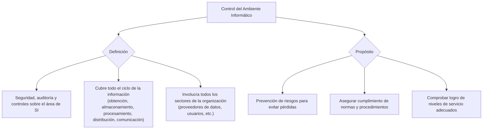

# Unidad 6: Control del ambiente informático

Conjunto conformado por la seguridad, la auditoría y los controles aplicados sobre el área de SI sus recursos, así como sobre todos los sectores asociados al procesamiento de información de la organización.

No debe haber ningún punto del tratamiento de la información (obtención, almacenamiento, procesamiento, distribución, comunicación).

**El ambiente informático** involucra no solo el correspondiente al departamento de procesamiento de datos sino también a **todos aquellos sectores de la organización que estén asociados con aquel**, ya sea porque son proveedores de datos a procesar o porque son usuarios de información procesada, o bien procesan información localmente y proveen datos de resumen al procesador central.

**Se controla el ambiente informático como medida de prevención de riesgos**, a manera de evitar posibles pérdidas para la organización. Además, se debe controlar que todas las actividades se efectúan de acuerdo con los procedimientos y normas fijados, así como comprobar el logro de los niveles de servicio adecuados. 