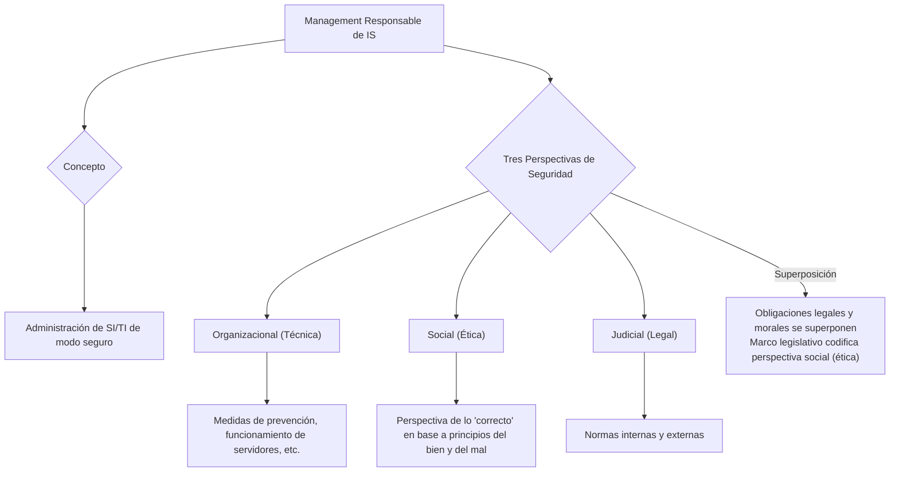

## **Management Responsable de IS** {#management-responsable-de-is}

Debemos controlar el ingreso de los datos, el procesamiento de los datos, a quién le llega la información ⇒ La Gestión de seguridad consiste en la administración de los SI/TI de un **modo seguro,** consiste en la ADMINISTRACIÓN, en ser RACIONALES.

Los SI deben ser seguros desde **tres puntos de vista (3 aspectos):**

1.  "seguros" desde un **punto de vista organizacional**, es decir, técnico o tecnología pura (que los servidores anden, que tengan medidas de prevención, etc.)
2.  "seguros" desde un **punto de vista social**, es decir, ético. (Proveedores, clientes, entes externos, etc.). Perspectiva de lo que es "correcto" o no, en base a los principios del bien y del mal.
3.  "seguros" desde un **punto de vista judicial**, es decir, legal. (normas internas y externas).

**Estos tres puntos de vista se superponen.** Es frecuente que existan obligaciones legales y morales en relación con la seguridad de la información y su almacenamiento, procesamiento y recuperación. El marco legislativo actual de los SI codifica una perspectiva social de lo que es correcto, es decir, de la ética. Mantener la seguridad de los SI puede plantear dilemas legales y éticos. 