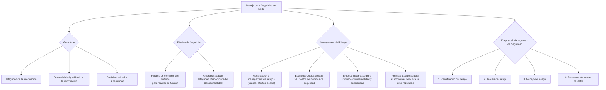

### Manejo de la seguridad de los SI {#manejo-de-la-seguridad-de-los-si}

De los 3 puntos de vista, nos vamos a meter en la cuestion tecnica ⇒ al hablar de gestión de la seguridad desde un punto de vista técnico, hablo de **garantizar que:**

-   La información sea **íntegra**
-   La información esté **disponible** y permite operar con ella (que sea **útil** para alguna función)
-   La información es **confidencial** (no es info reservada, sino que hay determinadas cuestiones que deben tener una restricción de acceso, al saldo de mi cuenta debo acceder solo yo) La información sólo ha de estar disponible para agentes autorizados, especialmente su propietario (**Autenticidad** → El sistema ha de ser capaz de verificar la identidad de sus usuarios, y los usuarios la del sistema.)

Al hablar de **pérdida de seguridad** es cuando al sistema le ocurrió algo que está alterando uno de los items de arriba, o los tres juntos. Ésta puede definirse como: "la falla de los elementos de un sistema de información computarizado para realizar la función o brindar el o los servicios para los cuales estaba destinado". **Las amenazas** tratan de atacar alguna de esas tres ya que luego se van propagando.

⇒ La gestión de la seguridad del ambiente informático implica gestionar los recursos SI/TI de **un modo responsable**. Este aspecto se refiere a la **visualización y el management de los riesgos** en términos de las causas, los efectos y, por tanto, los costos que implica una pérdida de seguridad.

De esta definición se desprende la noción de que las organizaciones necesitan administrar el riesgo de exposición de cada uno de los elementos de los SI. Este management deberá considerar **el equilibrio entre los costos resultantes de una falla de seguridad y los costos resultantes de las medidas necesarias para aumentar la seguridad**. El punto central es identificar el equilibrio óptimo.

![][image140]

El costo de no tener seguridad puede ser difícil de definir, aun cuando las fallas ocurran. El management del riesgo intenta **reducir estas pérdidas**. Un enfoque sistemático del management del riesgo permitirá que los SI de seguridad sean administrados de forma tal que **reconozcan la vulnerabilidad y la sensibilidad** de los sistemas de la empresa, y los datos que estos contienen, pero también los costos de los controles y las medidas para el manejo de riesgos. **Ningún sistema puede ser completamente seguro. El management permite elegir e implementar las contramedidas de una forma planeada y administrada**.

**Premisas**

-   **La seguridad total es imposible**. Sólo se logra un nivel razonable de seguridad. No es que nos sentimos inseguros, la seguridad siempre esta, pero esta es menor cuando tengo una mejor gestión de riesgo ⇒ +manejo de riesgo + seguro es mi entorno.
-   **Mejor manejo de riesgo**. Busca el equilibrio entre los costos resultantes de una falla y los costos resultantes de las medidas necesarias para aumentar la seguridad. Se apunta a la eficacia.

El management de seguridad de SI se reduce a 4 etapas que serán descriptas a continuación. 