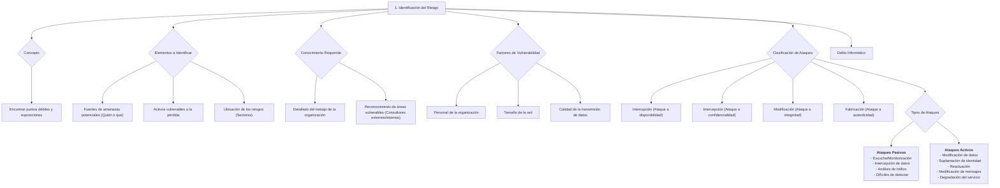

#### ***1- Identificación del riesgo***

Consiste en **encontrar los puntos débiles,** todo aquello a lo que, porque no lo tengo, estoy expuesto a:

-   **Fuentes de amenazas (puntos débiles) potenciales**: Quién o qué cosa se puede convertir en algo que puede provocar una falla de seguridad.
-   **Activos que son vulnerables a la pérdida**: Lo que se puede perder.
-   **Ubicación de esos riesgos:** ¿Dónde pueden estar? ¿En qué sectores?

⇒ Necesito ver los activos de mi organización y ver cuales son vulnerables, necesito identificar todas las posibles vulnerabilidades porque podrían aprovechar ese hueco para que una amenaza se pueda concretar.

**Tipos de amenazadas:**

-   Físicas accidentales
-   Físicas deliberadas
-   Logicas accidentaels
-   Lógicas deliberadas

Para realizar esta tarea, se necesitan dos cosas: un **conocimiento bastante detallado del trabajo de la organización**, más un **reconocimiento de las áreas que tienden a la vulnerabilidad**. Esta segunda parte, es decir, la comprensión del riesgo probable puede llevarse a cabo a través de consultores externos, pero la identificación de las amenazas específicas se realiza probablemente mejor mediante el personal o los consultores internos. Los consultores externos ofrecen un amplio conocimiento, mientras que el personal interno ofrece una profunda comprensión de la empresa. Pero ambas instancias hacen surgir la siguiente pregunta: ¿quién vigila a los que vigilan?

La vulnerabilidad de un área en particular es dependiente de los siguientes factores:

-   El personal de la organización.
-   El tamaño de la red.
-   La calidad de la transmisión de datos.

##### **Clasificación y tipos de ataques contra sistemas de información**

**Un ataque no es más que la realización de una amenaza.** Las cuatro categorías generales de amenazas o ataques son las siguientes:

-   Interrupción: un recurso del sistema es destruido o se vuelve no disponible. Este es un ataque contra la disponibilidad. Ejemplos de este ataque son la destrucción de un elemento hardware, como un disco duro, cortar una línea de comunicación o deshabilitar el sistema de gestión de ficheros.
-   Intercepción: una entidad no autorizada consigue acceso a un recurso. Este es un ataque contra la confidencialidad. La entidad no autorizada podría ser una persona, un programa o un ordenador. Ejemplos de este ataque son pinchar una línea para hacerse con datos que circulen por la red y la copia ilícita de ficheros o programas (intercepción de datos), o bien la lectura de las cabeceras de paquetes para desvelar la identidad de uno o más de los usuarios implicados en la comunicación observada ilegalmente (intercepción de identidad).
-   Modificación: una entidad no autorizada no sólo consigue acceder a un recurso, sino que es capaz de manipularlo. Este es un ataque contra la integridad. Ejemplos de este ataque son el cambio de valores en un archivo de datos, alterar un programa para que funcione de forma diferente y modificar el contenido de mensajes que están siendo transferidos por la red.
-   Fabricación: una entidad no autorizada inserta objetos falsificados en el sistema. Este es un ataque contra la autenticidad. Ejemplos de este ataque son la inserción de mensajes espurios en una red o añadir registros a un archivo. Estos ataques se pueden asimismo clasificar de forma útil en términos de ataques pasivos y ataques activos.

**Ataques pasivos**

En los ataques pasivos el atacante no altera la comunicación, sino que únicamente la escucha o monitoriza, para obtener información que está siendo transmitida.

Sus objetivos son la intercepción de datos y el análisis de tráfico, una técnica más sutil para obtener información de la comunicación, que puede consistir en:

-   Obtención del origen y destinatario de la comunicación, leyendo las cabeceras de los paquetes monitorizados.
-   Control del volumen de tráfico intercambiado entre las entidades monitorizadas, obteniendo así información acerca de actividad o inactividad inusuales.
-   Control de las horas habituales de intercambio de datos entre las entidades de la comunicación, para extraer información acerca de los períodos de actividad.

Los ataques pasivos son muy difíciles de detectar, ya que no provocan ninguna alteración de los datos. Sin embargo, es posible evitar su éxito mediante el cifrado de la información y otros mecanismos.

**Ataques activos**

Estos ataques implican algún tipo de modificación del flujo de datos transmitido o la creación de un falso flujo de datos, pudiendo subdividirse en cuatro categorías:

-   Suplantación de identidad: el intruso se hace pasar por una entidad diferente. Normalmente incluye alguna de las otras formas de ataque activo. Por ejemplo, secuencias de autenticación pueden ser capturadas y repetidas, permitiendo a una entidad no autorizada acceder a una serie de recursos privilegiados suplantando a la entidad que posee esos privilegios, como al robar la contraseña de acceso a una cuenta.
-   Reactuación: uno o varios mensajes legítimos son capturados y repetidos para producir un efecto no deseado, como por ejemplo ingresar dinero repetidas veces en una cuenta dada.
-   Modificación de mensajes: una porción del mensaje legítimo es alterada, o los mensajes son retardados o reordenados, para producir un efecto no autorizado. Por ejemplo, el mensaje "Ingresa un millón de pesos en la cuenta A" podría ser modificado para decir "Ingresa un millón de pesos en la cuenta B".
-   Degradación fraudulenta del servicio: impide o inhibe el uso normal o la gestión de recursos informáticos y de comunicaciones. Por ejemplo, el intruso podría suprimir todos los mensajes dirigidos a una determinada entidad o se podría interrumpir el servicio de una red inundándola con mensajes espurios. Entre estos ataques se encuentran los de denegación de servicio, consistentes en paralizar temporalmente el servicio de un servidor de correo, Web, FTP, etc.

Se denomina **delito informático** a toda acción culpable realizada por un ser humano, que cause perjurio a otras personas sin que necesariamente se beneficie el autor o que, por el contrario, produzca un beneficio ilícito al autor, aunque no perjudique de forma directa o indirecta a la víctima, tipificado por la ley, que se realiza en un entorno informático y está sancionado con una pena. 