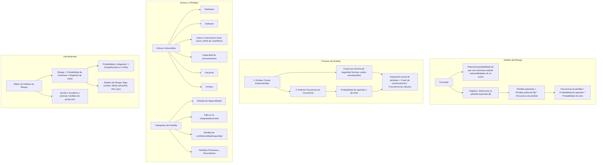

#### ***2- Análisis del riesgo*** {#2--análisis-del-riesgo}

El **riesgo es el potencial** (probabilidad) de que una **amenaza determinada explote las vulnerabilidades** de un activo o un grupo de activos, ocasionando su pérdida o daño (ISACA - Information Systems Audit and Control Association) ⇒ Debo analizar el impacto potencial para determinar **la pérdida esperada producida** ($) por una amenaza particular.

Pérdida esperada=Pérdida potencial ($) ∙ Frecuencia de pérdida

Donde

Frecuencia de pérdida=probabilidad agresión ∙ probabilidad de éxito

⇒ La etapa de análisis del riesgo es un proceso más estructurado, aunque a menudo de una manera cualitativa y no cuantitativa.

El análisis del impacto potencial **requiere de dos etapas.**

1.  **La primera evalúa los costos empresariales que surgen de una brecha en la seguridad.** Esta evaluación debería incluir, al menos, de un modo aproximado, cálculos financieros incluso para los costos conceptuales. Existe un gran número de aspectos relacionados con las pérdidas potenciales provenientes de una falla de seguridad.
2.  **A esto se le suma la posibilidad calculada de que suceda** y entonces la segunda etapa del análisis de riesgo consiste en estimar la frecuencia de ocurrencia de cualquier falla de seguridad a través de la probabilidad de agresión y la probabilidad de que la agresión prospere (se entiende por agresión a cualquier falla en la seguridad, no necesariamente a un deliberado abuso humano).

Exposición anual de pérdidas=Costo de las consecuencias . Frecuencia de los cálculos

**El análisis del riesgo** **establece un lado del punto de equilibrio óptimo entre el costo de pérdidas y el costo de medidas de seguridad →** identifica contra medidas posibles y luego elige el conjunto adecuado para ese trueque óptimo.

Los **activos vulnerables** a pérdidas debido a una amenaza pueden ser:

-   **Hardware:** pérdida relativamente fácil de evaluar y estos elementos están a menudo asegurados.
-   **Software:** la principal complicación cuando se evalúa la pérdida de software es que el valor intrínseco o costo de reemplazo, del software no tiene relación con el costo original de desarrollo. Para sumar complicaciones, la pérdida de software genera una pérdida de la capacidad de procesamiento y, entonces, el factor debe incluirse en la cuantificación de pérdida del software.
-   **Datos e información:** es la pérdida más seria y la más difícil de cuantificar.
-   **Capacidad de procesamiento:** la duración de la interrupción es la variable clave al determinar el valor de la pérdida.
-   **Personal:** esta pérdida puede ser significativa ya sea por su conocimiento teórico o por su competencia práctica.
-   **Fondos:** plata.

Todas las pérdidas que resultan de una falla en la seguridad se relacionan con los atributos de valor agregado de la información y se las puede dividir en tres categorías:

-   **Pérdida de disponibilidad:** la pérdida de la seguridad destruye, total o parcialmente, la habilidad de la empresa para acceder a datos e información.
-   **Falla en la integridad/precisión:** la pérdida de seguridad destruye la capacidad de una empresa para confiar en sus datos, o peor, de contar con datos de precisión incierta.
-   **Pérdida de confidencialidad/seguridad:** la pérdida de seguridad destruye la posesión exclusiva de datos, lo que provoca que la organización pierda poder y confianza. Una vez más, el peor caso es el de la incertidumbre.

**Pérdidas resultantes de una falla**: no debo evaluar materialmente lo que me sale la falla, debo ver como juegan las situaciones, **debo comprender mis pérdidas primarias** (aquellas cosas que se desprenden directamente, y por lo general en forma inmediata, de un problema en la seguridad) **y secundarias** (que surgen como consecuencia de las pérdidas primarias, y no de una falla en sí misma).

![][image141]

La magnitud de la pérdida total de una falla en la seguridad es la suma de las consecuencias primarias y secundarias. En el caso de que las consecuencias primarias puedan ser minimizadas, entonces habría una doble ganancia, porque si se reducen las pérdidas primarias, entonces las secundarias también se minimizan.

##### **Matriz para el Análisis de Riesgo**

La Matriz la basé en el método de Análisis de Riesgo con un grado de riesgo, usando la fórmula Riesgo = Probabilidad de Amenaza x Magnitud de Daño, en donde la Probabilidad de [Amenaza](https://protejete.wordpress.com/glosario/#amenaza) y Magnitud de Daño pueden tomar los valores y condiciones respectivamente:

-   1 = Insignificante (incluido Ninguna)
-   2 = Baja
-   3 = Mediana
-   4 = Alta

El Riesgo, está agrupado en tres rangos, y para su mejor visualización, se aplican diferentes colores.

-   Bajo Riesgo = 1 – 6 (verde)
-   Medio Riesgo = 8 – 9 (amarillo)
-   Alto Riesgo = 12 – 16 (rojo)

La Matriz contiene una colección de diferentes Amenazas (campos verdes) y [Elementos de información](https://protejete.wordpress.com/glosario/#elementos) (campos rojos). Para llenar la Matriz, tenemos que estimar los valores de la Probabilidad de Amenaza (campos azules) por cada Amenaza y la Magnitud de Daño (campos amarillas) por cada Elemento de Información.

![][image142]

Para la estimación de la Probabilidad de amenazas, se trabaja con un valor generalizado, que (solamente) está relacionado con el recurso más vulnerable de los elementos de información, sin embargo usado para todos los elementos.

Dependiendo de los valores de la Probabilidad de Amenaza y la Magnitud de Daño, la Matriz calcula el producto de ambas variables y visualiza el grado de riesgo.

![][image143]

Dependiendo del color de cada celda, podemos sacar conclusiones no solo sobre el nivel de riesgo que corre cada elemento de información de sufrir un daño significativo, causado por una amenaza, sino también sobre las medidas de protección necesarias

-   Proteger los datos de RR.HH, Finanzas contra virus
-   Proteger los datos de Finanzas y el Coordinador contra robo
-   Evitar que se compartan las contraseñas de los portátiles

También, como se mencionó anteriormente, existen combinaciones que no necesariamente tienen mucho sentido y por tanto no se las considera para definir medidas de protección

-   Proteger el Personal (Coordinador y Personal técnico) contra Virus de computación
-   Evitar la falta de corriente para el Coordinador 