#### ***3- Manejo del Riesgo***

```mermaid
graph TD
    A["Manejo del Riesgo"] --> B{Decisión Estratégica};
    B --> C["Elegir estrategia adecuada según valoración previa"];
    B --> D["Aplicar controles y contramedidas racionales (tiempo, dinero, restricciones)"];

    A --> E{Estrategias Genéricas};
    E --> F["<b>Prevenir el riesgo:</b><br/>Evitar la amenaza (ej. ubicar sistemas en áreas seguras)"];
    E --> G["<b>Asumir el riesgo:</b><br/>Cuando las pérdidas totales son tolerables"];
    E --> H["<b>Reducir el riesgo:</b><br/>Introducir controles para disminuir probabilidad y/o pérdidas"];
    E --> I["<b>Transferir el riesgo:</b><br/>Pasar costos a un tercero (ej. seguros, contratos)"];

    A --> J{Políticas de Seguridad};
    J --> K["Documentan el resultado del análisis y las estrategias elegidas"];
    K --> L["Definen nivel de seguridad vs. valor a proteger"];
    K --> M["Cubren: protección, valor, acceso y recuperación de la información"];
    J --> N{Tipos de Políticas};
    N --> O["<b>Prohibitiva:</b><br/>Todo lo no permitido está denegado (más restrictiva)"];
    N --> P["<b>Permisiva:</b><br/>Todo lo no prohibido está permitido"];
    J --> Q{Ciclo de Vida de una Política};
    Q --> R["Desarrollo (Creación, Revisión, Aprobación)"];
    Q --> S["Implementación (Comunicación, Cumplimiento, Excepciones)"];
    Q --> T["Mantenimiento (Concientización, Monitoreo, Garantía)"];
    Q --> U["Eliminación (Retiro)"];

    A --> V{Controles y Contramedidas};
    V --> W["Implementan las estrategias de manejo de riesgo"];
    V --> X["<b>Contramedidas Generales:</b><br/>Reducen la amenaza en todas las actividades de SI"];
    V --> Y["<b>Controles de Aplicación:</b><br/>Protegen un área específica"];
    V --> Z{Líneas de Defensa};
    Z --> AA["1ª: Prevención (ej. prohibir fumar)"];
    Z --> BB["2ª: Detección (ej. detector de humo)"];
    Z --> CC["3ª: Recuperación (ej. backups)"];
    V --> DD{Tipos de Controles};
    DD --> EE["<b>Lógicos:</b><br/>Aseguran desarrollo, integridad y operaciones (ej. contraseñas, encriptación)"];
    DD --> FF["<b>Físicos:</b><br/>Filtran el acceso físico (ej. cerraduras, vigilancia)"];
```

Me debo decidir por una **estrategia** de manejo de riesgo adecuada que mantengan el equilibrio deseado y que me conviene aplicar según la valoración de la etapa anterior, y según la misma aplicar **controles y contramedidas apropiadas de acuerdo con criterios racionales** (tiempo, dinero y alguna otra restricción. No voy a tener el manejo más óptimo, pero **el mejor que pueda implementar**).

**Existen cuatro estrategias genéricas para el manejo del riesgo:**

1.  **Prevenir el riesgo:** se intenta evitar la amenaza. Por ej.: colocar los sistemas lejos de las áreas peligrosas, ubicar los datos delicados en áreas protegidas, no descentralizar, capacitar etc.
2.  **Asumir el riesgo:** se utiliza cuando las pérdidas totales (suma de las consecuencias primarias y secundarias) son tolerables por la organización.
3.  **Reducir el riesgo:** resulta difícil evitar por completo el riesgo. Consiste en la introducción de controles y contramedidas para reducir la probabilidad de ocurrencia y/o para reducir las pérdidas resultantes de una falla en la seguridad.
4.  **Transferir el riesgo:** transfiere los costos resultantes de una falla en la seguridad a un tercero, que en general implica pólizas de seguros o contratos de mantenimiento.

##### **Políticas de Seguridad**

Son en sí misma un entorno para ver e implementar medidas, **son enunciados que me marcan lo que tengo que hacer.**

Cada vez más, la seguridad de los SI debe ser considerada como **un tema estratégico, y toda empresa debería invertir en seguridad.** Una **política de seguridad** define el nivel de seguridad que se ajusta al valor de lo que se debe proteger y al gasto e inconveniencia de las medidas de protección. E**sas políticas documentan el resultado de la identificación y en análisis del riesgo, y de las estrategias elegidas para manejarlo.**

El documento debe cubrir al menos:

-   La protección de la información.
-   El valor de la información.
-   El acceso a la información.
-   La recuperación de la información.

**Una política de seguridad define un conjunto de requisitos** sobre un sistema que indican en términos generales qué está y qué no está permitido hacer en el área de seguridad durante la operación normal de dicho sistema.

Los términos generales definidos en la política de seguridad deben refinarse para convertirlos en indicaciones precisas de qué es lo permitido y lo denegado, estas son **políticas de aplicación específicas.**

***Tipos de políticas de seguridad:***

-   **Prohibitiva:** si todo lo que no está expresamente permitido, está denegado. Esta es mucho más restrictiva y se podría considerar que son más efectivas en cuanto a seguridad se refiere.
-   **Permisiva:** si todo lo que no está expresamente prohibido, está permitido.

***Ciclo de vida de una política:***

1.  **Fase de desarrollo:**
    -   **Creación:** se planifica, investiga y redacta una política. Implica identificar la necesidad de la política, determinar el alcance de la misma y su aplicabilidad.
    -   **Revisión:** con la política documentada, se la remite a un grupo o individuo para su revisión independiente antes de la aprobación final.
    -   **Aprobación:** se debe obtener apoyo de la administración. La aprobación permite iniciar la implementación de la política.
2.  **Fase de implementación:**
    -   **Comunicación:** consiste en difundir la política, concientizar a los miembros de la organización de la misma.
    -   **Cumplimiento:** se debe hacer seguimiento del cumplimiento de la misma.
    -   **Excepciones:** debido a problemas de gestión, no todas las políticas pueden cumplirse de la forma inicialmente planteada. Es por esto que a veces existen excepciones que deben documentarse.
3.  **Fase de mantenimiento:**
    -   **Concientización:** busca que las personas estén cumpliendo la política y entiendan su importancia en la estructura organizativa. Es un trabajo continuo.
    -   **Monitoreo:** realizar un seguimiento y reportar la efectividad de la política.
    -   **Garantía de cumplimiento:** identifica omisiones a la política para luego de un análisis de sus causas, intentar prevenir que sigan ocurriendo.
    -   **Mantenimiento:** la política es contingencial.
4.  **Fase de eliminación:**
    -   **Retiro:** después de que la política haya cumplido con su finalidad y no es necesaria (por ejemplo, por grandes avances tecnológicos) debe ser retirada.

##### **Controles y contra-medidas**

**Las estrategias de manejo del riesgo se implementan a través de controles y contra-medidas**. Las medidas de seguridad y control deben ser consideradas en términos de los costos netos y de los nuevos riesgos potenciales resultantes de su adopción.

Existen fundamentalmente dos tipos de control: **las contramedidas generales** que se introducen para reducir la amenaza de todas las actividades de los SI dentro de una organización; **y los controles de aplicación diseñados para proteger de amenazas a un área específica.** Un punto débil en los controles generales podría provocar una pérdida de seguridad en cualquier sistema y así, el costo de estas medidas debería considerarse "compartido" por todas las áreas protegidas.

Para dar como resultado una "buena" seguridad, las diversas amenazas deben ser combatidas por capas de controles dirigidos a diferentes aspectos del uso y management de los SI.

En el caso de los SI los factores determinantes son:

-   **Plataforma del HW:** que ejerce influencia en el tipo y la cantidad de controles disponibles
-   **Grado de distribución:** que influye en el énfasis de los controles requeridos
-   **Integración de la infraestructura**: que influye en la naturaleza de las amenazas

Cualquier cambio en este entorno de los SI significa que las consecuencias de seguridad se extienden por todas las capas de control.

| 1ª línea de defensa | Prevención | Prevenir amenazas; por ej., prohibir que se fume en el centro de datos |
| :--- | :--- | :--- |
| **2ª línea de defensa** | **Detección** | Detectar fallas de seguridad a pesar de la primera línea de defensa, por ej., un detector de humo |
| **3ª línea de defensa** | **Recuperación** | Recuperarse de una falla de seguridad con pérdidas mínimas; por ej., backups de datos off-site. |

Las contra-medidas seleccionadas pueden ser lógicas o físicas. **Los controles lógicos** son las medidas adoptadas para asegurarse de que el desarrollo, la integridad de los datos y las operaciones continúen sin tropiezos. Una de las medidas de control lógico más común, y a menudo, inadecuada, es la identificación del usuario y los sistemas de contraseñas para restringir el acceso a los sistemas.

**Las medidas físicas de seguridad** generan más costos, son menos efectivas y más propensas a producir resentimiento, y, por lo tanto, su uso debe ser cuidadosamente evaluado. Los controles físicos de seguridad pueden incluir el uso de personal de seguridad, sistemas de vigilancia, cerraduras, tarjetas con clave y otros métodos de acceso. Estas medidas filtran el acceso físico a la utilización de los elementos de SI.

**Ejemplos de controles y contra-medidas:**

-   Estándares de operatividad
-   División de responsabilidades
-   Medidas de seguridad de la red
-   Contraseñas
-   Encriptación de datos
-   Antivirus
-   Detección y prevención de incendios 