## **Auditoría (de sistemas)** {#auditoría-(de-sistemas)}

```mermaid
graph TD
    A["Auditoría de Sistemas"] --> B{Definición};
    B --> C["Actividad profesional con contenido, condición, justificación, objeto y finalidad"];
    C --> D["<b>Contenido:</b> Opinión profesional del auditor"];
    C --> E["<b>Condición:</b> Profesional"];
    C --> F["<b>Justificación:</b> Sustentada en procedimientos elegidos"];
    C --> G["<b>Objeto:</b> Informe sobre información obtenida"];
    C --> H["<b>Finalidad:</b> Determinar si la actividad presenta adecuadamente la realidad"];

    A --> I{Naturaleza de la Auditoría};
    I --> J["Financiera"];
    I --> K["Administrativa"];
    I --> L["De gestión (RRHH, Calidad)"];
    I --> M["<b>De Sistemas de Información</b>"];

    A --> N{Planificación de una Auditoría};
    N --> O["Inicio: Contrato de auditoría con objetivos y autoridad"];
    N --> P["Comprensión del medio ambiente a revisar"];
    N --> Q["Conocimiento de leyes y regulaciones pertinentes"];

    A --> R{Concepto de Auditoría de SI/TI};
    R --> S["<b>Objeto:</b> Recursos informáticos, función de SI, aplicaciones, proyectos, etc."];
    R --> T["<b>Finalidad:</b> Operatividad efectiva y segura según normas"];
    R --> U["Revisión sistemática para verificar propiedades:"];
    U --> V["Vigencia de objetivos"];
    U --> W["Grado de consistencia (efectividad)"];
    U --> X["Permanencia del diseño"];
    U --> Y["Eficiencia (Costo/Beneficio)"];

    A --> Z{Funciones del Auditor Informático};
    Z --> AA["Participar en revisiones durante el ciclo de vida de las aplicaciones"];
    Z --> BB["Revisar y juzgar los controles implantados"];
    Z --> CC["Revisar y juzgar eficacia, utilidad, fiabilidad y seguridad de los equipos"];
```

Cualquier **auditoría** es una actividad consistente en:

-   Un **contenido**: Es una opinión (profesional) del auditor.
-   Una **condición**: Profesional.
-   Una **justificación**: Sustentada en determinados procedimientos elegidos (tareas, acciones y pruebas que se hacen para probar el hecho)
-   Un **objeto**: Es un informe. Una determinada información obtenida en un cierto soporte.
-   Una **finalidad**: Determinar si la actividad presenta adecuadamente la realidad o ésta responde a las condiciones que le son atribuidas. Normalmente estas condiciones tienen que ver con la fiabilidad (si estos están funcionando en forma fiable, dan confianza sistemas)

**Naturaleza (tipo) de auditoría:**

-   Financiera, por ejemplo, cómo se maneja el dinero.
-   Administrativa, por ejemplo, si se respetan los procedimientos administrativos.
-   De gestión de Recursos Humanos, de calidad: Si se cumplen con los procedimientos, si se tienen políticas adecuadas de recursos humanos, de qué forma se gestiona al personal – Las de calidad se comparan contra una norma que puede ser una ISO; o se adhiere al CSMI.
-   **De Sistemas de Información → lo que nos compete**

### Planificación de una auditoría

El **punto de inicio es un contrato de auditoría** que establezca con claridad los objetivos de la gerencia para la auditoría de IS y para delegar la autoridad de la misma. Cuando se planifica una auditoría, el auditor de SI debe tener una comprensión del medio ambiente general que está en revisión. Esto debe incluir una comprensión general de las diversas prácticas del negocio y las funciones relativas al sujeto de auditoría, así como también los tipos de sistemas de información que respaldan la actividad.

Luego se entrará más en detalle en las [etapas de la auditoría](#2--etapas-de-la-auditoría).

**Leyes y regulaciones**

Cada organización necesita cumplir con un número de requisitos del gobierno y externos relacionados con las prácticas y los controles de sistemas de cómputo. Estos requisitos deben ser conocidos por el auditor IS. En base a esto, el auditor IS documentará las leyes y regulaciones pertinentes para luego determinar si la gerencia de la organización y la función de los sistemas de información han tomado en consideración los requisitos externos relevantes al hacer los planes y al fijar las políticas, las normas y los procedimientos.

El auditor, en su labor de alcanzar un entendimiento del negocio, puede recorrer las instalaciones claves de la organización, revisar los planes estratégicos, entrevistar a los gerentes, estudiar los reportes regulatorios, revisar reportes anteriores, etc.

### Concepto de Auditoría de SI/TI

**Objeto**: Algo que la auditoría REVISA, la condición por la cual la auditoría se realiza. Recursos informáticos, función de SI (unidad organizativa), aplicaciones, Proyectos, Planes de Contingencia, los almacenamientos de datos, etc.

**Finalidad**: Contra qué se va a decir si es adecuado o no el funcionamiento. Operatividad efectiva y segura según normas establecidas.

**El auditor no tiene por qué decirle cómo tiene que hacer las cosas a quién revisa**; debe controlar que realice sus funciones según los estándares.

⇒ La **auditoría de sistemas** ha sido definida como la **revisión sistemática** (periodicidad determinada) organizada de los sistemas en funcionamiento **para ver si en ellos se verifican las propiedades:**

-   **Vigencia de los objetivos** planteados como base del diseño original. Ejemplo Sysacad: agilizar registro de cursados y exámenes. Actualmente el sistema además de su objetivo definido realiza otras funciones (parches). Demandas a las aplicaciones de las cuales no estaban pensadas.
-   **Grado de consistencia** de ese sistema con respecto a los objetivos (efectividad). *¿Lo que tengo responde al diseño original?*
-   **Permanencia del diseño** por no haber sufrido alteraciones que lo degradaran operativamente.
-   **Eficiencia del sistema** (Relación COSTO/BENEFICIO). Administrar el sistema, información que me brinda y relación con los beneficios y costos. *¿Cómo estoy?*

Se pueden establecer **tres grupos de funciones a realizar por un auditor informático:**

-   Participar en las revisiones durante y después del diseño, realización, implantación y explotación de aplicaciones, así como en las fases análogas de realización de cambios importantes.
-   Revisar y juzgar los controles implantados en los sistemas para verificar su adecuación a las órdenes e instrucciones de la Dirección, requisitos legales, protección de confidencialidad y cobertura ante errores y fraudes.
-   Revisar y juzgar el nivel de eficacia, utilidad, fiabilidad y seguridad de los equipos de información.

**⇒ La auditoría de sistemas de información debe asegurar:**

-   La existencia de **pistas de auditoría** de modo que las operaciones puedan ser rastreadas a través de todo el sistema ⇒ deben existir **puntos de control** para el seguimiento de los datos y la descripción del procedimiento.
-   La existencia de **controles adecuados con respecto a la entrada de datos y al mantenimiento** de la integridad de los mismos, así como también de las transacciones que se efectúan con ellos a través del seguimiento computarizado del sistema.
-   El **manejo adecuado de las excepciones y de los rechazos** originados por los controles de entrada de datos, y el aseguramiento de su incorporación al sistema en los casos que corresponda.
-   El **aseguramiento de las políticas** corporativas y el cumplimiento de reglamentos gubernamentales hayan sido incorporados al sistema.
-   La **verificación** de que los sistemas se comporten conforme fueron definidos.
-   El **control de que las modificaciones** que se operen sobre los sistemas sean debidamente autorizadas por el nivel jerárquico que corresponda.
-   La **existencia de condiciones y procedimientos de seguridad** que protejan los datos de la organización.
-   El **aseguramiento de la adecuada interconexión** entre los diversos sistemas.

#### ***Aspectos a revisar por la auditoría de sistemas***

-   Revisión de controles generales que afectan a la estructura de la organización, a las políticas y procedimientos y al ambiente de control de sistemas de información.
-   Revisión de las operaciones de procesamiento de información en el ambiente informático.
-   Revisión de seguridad en cuanto a la calidad del acceso lógico, físico y de los controles existentes en el ambiente informático.
-   Evaluar las condiciones de seguridad física de la sede alternativa.
-   Revisión del software del sistema operativo.
-   Revisión de la metodología de desarrollo de sistemas de información.
-   Revisión de los controles de software de aplicación.
-   El auditor tiene que verificar que se hayan establecido prioridades para las aplicaciones según su grado de tolerancia.
-   Plan de contingencias: que exista y que sea coherente con los objetivos propuestos. El auditor debe evaluar el plan de contingencias verificando su adecuación y actualización.
-   Debe examinar el inventario de los dispositivos almacenados en la sede alternativa.
-   Debe evaluar el grado de capacitación del personal, verificando que se realicen simulacros. 