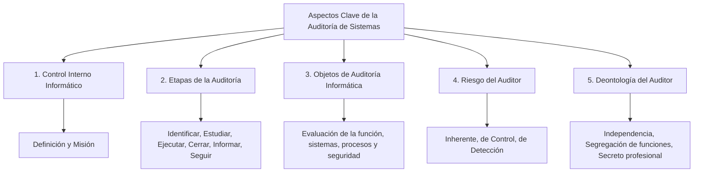

### Aspectos clave de la auditoría de sistemas

1.  [Control interno informático](./09a_control_interno_informatico.md)
2.  [Etapas de la auditoría](./09b_etapas_auditoria.md)
3.  [Objetos (secciones) de auditoría informática](./09c_objetos_auditoria.md)
4.  [Riesgo del auditor (Etapa inicial)](./09d_riesgo_auditor.md)
5.  [Deontología (normas éticas) del auditor](./09e_deontologia_auditor.md) 