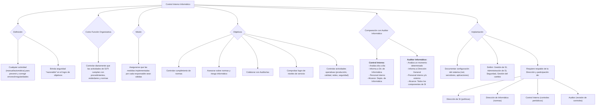

#### ***1- Control interno informático:***

**Tiene que decir si cumple con las reglas internas de la empresa.** Se puede definir el control interno como cualquier actividad o acción realizada manual o automáticamente para prevenir, corregir errores o irregularidades que puedan afectar al funcionamiento de un sistema para cumplir sus objetivos.

Todo sistema de control interno tiene limitaciones. Es por esta razón que sólo puede brindar una seguridad *razonable* en el logro de sus objetivos.

**Como Función Organizativa:** Controlar diariamente que todas las actividades de los SI/TI sean realizadas cumpliendo los procedimientos, estándares y normas fijados por la dirección de la organización y/o la dirección informática, así como con los requerimientos legales.

**Misión (finalidad):** Asegurarse que las medidas implementadas por cada responsable sean válidas. Es no sólo ver que se cumple, sino ver que lo que se está cumpliendo es lo adecuado.

**Objetivos:**

-   Controlar que todas las actividades se efectúen de acuerdo con los procedimientos y normas fijados.
-   Asesorar sobre el conocimiento y aplicación de las normas, así como asesorar y transmitir.
-   Colaborar con las Auditorías Informáticas, tanto internas como externas.
-   Intervenir en la definición, implementación y ejecución de mecanismos y controles para comprobar el logro de los niveles de servicios adecuados (no es sólo responsabilidad del C.I.I. Normalmente existe un área de control interno, pero no toda la culpa es de control interno si las cosas no salen como deberían)
-   Realizar sobre los diferentes SI y entornos informáticos el control de las actividades operativas como:
    -   Cumplimiento de procedimientos, normas y controles (Control de cambios de las versiones de SW).
    -   Controles sobre la producción diaria.
    -   Control de calidad y eficiencia en el desarrollo y mantenimiento del SW.
    -   Controles sobre redes y SW de base.
    -   Controles sobre la seguridad informática
        -   Usuarios, responsables y perfiles de uso de archivos y bases de datos.
        -   Normas de seguridad.
        -   Control de información clasificada
        -   Control dual de la seguridad informática.
    -   Controles sobre licencias y relaciones contractuales de tercerización.
    -   Asesorar y transmitir cultura sobre el riesgo informático.

##### **Comparación de control interno y el auditor informático**

Podríamos decir que:

-   El área informática monta los procesos informáticos seguros.
-   El control interno monta los controles.
-   La auditoría informática evalúa el grado de control.

| | Control interno informático (área) | Auditor informático |
| ----- | :---: | :---: |
| **Similitudes** | Personal especializado en Tecnología de la Información Verificación del cumplimiento de controles internos, normativa y procedimientos establecidos por la Dirección de Informática y la Dirección General para los sistemas de información | |
| **Diferencias** | Análisis de los controles en el día a día | Análisis de un momento informático determinado |
| | Informa a la dirección del Departamento de informática | Informa a la Dirección General de la organización |
| | Sólo personal interno | Personal interno y/o externo |
| | El alcance de sus funciones es únicamente sobre el Departamento de Informática | Tiene cobertura sobre todos los componentes de los sistemas de información de la organización |

⇒ El **control interno** es cualquier actividad o acción realizada manual o automática para prevenir y corregir errores o irregularidades que puedan afectar el funcionamiento de un sistema con respecto a sus objetivos. *El tipo de controles interno puede ser: Preventivo, Detectivo y Correctivo.*

##### **Implantación de un sistema de controles internos informáticos**

Para llegar a conocer la configuración del sistema es necesario documentar los detalles de la red, así como los distintos niveles de control y elementos relacionados:

-   Entorno de red.
-   Configuración de servidores (ordenador base).
-   Entorno de aplicaciones.
-   Productos y herramientas que se estén utilizando.
-   Esquema de seguridad sobre ordenador central.

Para la implantación de un sistema de controles internos informáticos **habrá que definir:**

-   Gestión de SI.
-   Administración de SI.
-   Seguridad ([sus cuatro etapas](#manejo-de-la-seguridad-de-los-si))
-   Gestión del cambio (no solo las mejoras perfectivas)

La implantación de una política y cultura sobre la seguridad requiere que sea realizada por fases y esté respaldada por la Dirección. **Cada función juega un papel importante en las distintas etapas:**

-   **Dirección de Sistemas de Información (SI):** Han de definir la política y/o directrices para los sistemas de información en base a las exigencias del negocio, que podrán ser internas o externas.
-   **Dirección de Informática:** Ha de definir las normas de funcionamiento del entorno informático y de cada una de las funciones de Informática mediante la creación y publicación de procedimientos, estándares, metodología y normas aplicables a todas las áreas de Informática.
-   **Control Interno Informático:** Define los controles periódicos a realizar en cada una de las funciones informáticas.
-   **Auditor interno/externo informático:** ha de revisar los diferentes controles internos definidos en cada una de las funciones informáticas y el cumplimiento de normativa interna y externa. 