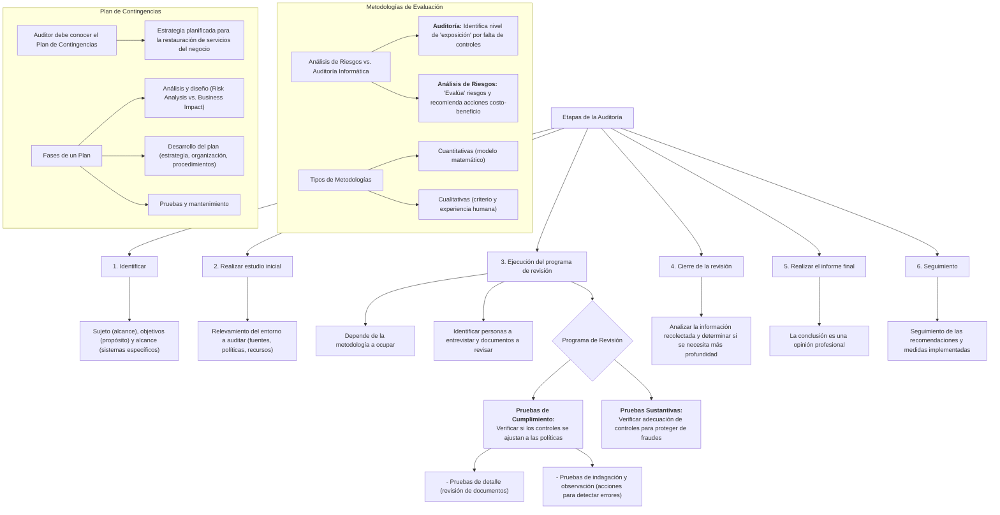

#### ***2- Etapas de la Auditoría*** {#2--etapas-de-la-auditoría}

1.  **Identificar:**
    1.  **El sujeto** (hasta donde va a llegar la auditoría, hasta cuál área),
    2.  **los objetivos** (se define PARA QUÉ se va a realizar la auditoría, la intencionalidad, lo que pretendo que se evalúe)
    3.  **y el alcance** (los sistemas específicos, la función o unidad de la organización en la revisión) de la auditoría informática.
2.  **Realizar el estudio inicial** del entorno a auditar (relevamiento inicial, estudio del ambiente informático: ver fuentes de información, políticas, normas, documentación, habilidades y recursos técnicos necesarios, ubicaciones o instalaciones que serán auditadas, etc).
3.  Ejecución del **programa de revisión** → Depende de la metodología a ocupar. También se debe identificar las listas de personas para entrevistar y obtener políticas, normas y directrices de los departamentos para su revisión.
4.  **Cierre de la revisión.** El auditor se sienta a ver si todo lo que recolectó cierra consistentemente o tiene que profundizar en algo más.
5.  Realizar el [**informe final**](#informes-de-auditoría) (la conclusión en sí es una opinión).
6.  **Seguimiento**. Recomendaciones que el auditor puede hacer, la empresa puede llevar a cabo ciertas medidas y por ende realizar seguimiento de las mismas.

##### **Programa de revisión**

###### *Tipos de prueba*

Conjunto de cosas que voy a hacer en la auditoría → Los procedimientos de la auditoría son normalmente acciones de verificación, de comprobación que pueden involucrar dos tipos de pruebas:

-   **Pruebas *de cumplimiento***: Tienen por objeto determinar si los controles se ajustan a las políticas y procedimientos de la organización y se aplican conforme a la descripción de la documentación de los programas informáticos ⇒ consiste en verificar si las normativas y reglas se cumplen o no.
    A su vez, las pruebas de cumplimiento pueden ser:
    -   **Pruebas de detalle**: Consisten en la revisión de documentos → Es más pasivo
    -   **Pruebas de indagación y observación**: Implica tomar acciones para detectar errores → Son más activas. Por ejemplo: Indagar al personal sobre las acciones correctivas que aplican para situaciones de excepción; observar el comportamiento de programas de edición ante situaciones simuladas de generar errores en ingresos de datos.

-   **Pruebas *sustantivas***: Intentan verificar la adecuación de los controles existentes para proteger a la organización de acciones fraudulentas. Le importa cómo se procesa la información: Puede hacer procesamiento en paralelo, por ejemplo. Sirven para ver si eso puede provocar errores en el proceso dañando la integridad de la información

Se trata de asegurar que los controles implementados (manuales o automatizados) son robustos ante la posibilidad de alterar la información.

###### *Contenido del programa de revisión*

El programa de auditoría es un conjunto de instrucciones que guía a los auditores involucrados y sirve como medio para el control y registro de la ejecución apropiada del trabajo. Dado que los programas de auditoría se preparan anticipadamente en la etapa de planeación, estos pueden ser modificados a medida en que se ejecuta el trabajo, teniendo en cuenta los hechos concretos que se vayan observando.

1.  Deriva del plan general de auditoría general.
2.  Se elabora un programa de auditoría por cada área de auditoría, o sea, por cada sección a auditar.
3.  Detalla:
    1.  La naturaleza, oportunidad y alcance de los procedimientos de auditoría en el marco del plan general.
    2.  Una descripción de los objetivos de auditoría que se persiguen en la revisión de la sección a auditar.
    3.  Las fuentes de evidencias
    4.  El equipo de auditoría
    5.  Las actividades, y para cada una, el tiempo estimado, el tiempo real, la referencia al papel de trabajo donde quedó plasmado la ejecución del programa a rúbrica de quien realizó cada paso y la fecha del mismo.
    6.  Condiciones o situaciones que requieran toma de decisiones.

##### **Metodologías de evaluación de sistemas**

Las dos metodologías de evaluación de sistemas por antonomasia son las de ANÁLISIS DE RIESGOS y las de AUDITORÍA INFORMÁTICA, con dos enfoques distintos. **La auditoría informática sólo identifica el nivel de "exposición" por la falta de controles, mientras el análisis de riesgos facilita la "evaluación" de los riesgos y recomienda acciones en base al costo-beneficio de las mismas.**

###### *Tipo de metodologías*

-   **Cuantitativas:** basadas en un modelo matemático numérico que ayuda a la realización del trabajo.
-   **Cualitativas:** Basadas en el criterio y raciocinio humano capaz de definir un proceso de trabajo, para seleccionar en base a la experiencia acumulada.
    ![][image144]

##### **Plan de contingencias**

El auditor debe conocer perfectamente los conceptos de un plan de contingencias para poder auditarlo. Plan de contingencias y de recuperación del negocio es lo mismo, pero no así el plan de restauración interno (éste va enfocado hacia la restauración del C.P.D, pero sobre eventos que suceden dentro del entorno (caídas del sistema roturas leves, etc.) y cuya duración no afecta gravemente a la continuidad del negocio.

**Definición:** El [Plan de Contingencias](#4--recuperación-ante-el-desastre) es una estrategia planificada constituida por: un conjunto de recursos de respaldo, una organización de emergencia y unos procedimientos de actuación encaminada a conseguir una restauración progresiva y ágil de los servicios de negocio afectados por una paralización total o parcial de la capacidad operativa de la empresa.

Esa estrategia, materializada en un manual, es el resultado de todo un proceso de análisis es el resultado de todo un proceso de análisis y definiciones qué es lo que da lugar a las metodologías. Es muy importante tener en cuenta que el concepto a considerar es "la continuidad, el negocio"; estudiar todo lo que puede paralizar la actividad y producir pérdidas. Todo lo que no considere este criterio no será nunca un plan de contingencias.

**Fases de un plan:**

-   **Análisis y diseño:** se estudia la problemática, las necesidades de recursos, las alternativas de respaldo, y se analiza el coste/beneficio de las mismas. Ésta es la fase más importante, pudiendo llegar al final de la misma incluso a la conclusión de que no es viable o muy costoso su seguimiento. En la forma de desarrollar esta fase, se diferencian las dos familias metodológicas.
    -   **Risk Analisis:** se basan en el estudio de posibles riesgos desde el punto de vista de probabilidad de que los mismos sucedan. Aunque los registros de incidentes, al igual que ocurría en las metodologías de análisis de riesgos, son escasos y poco fiables, aun así, es más fácil encontrar este tipo de metodologías que las segundas.
    -   **Business Impact:** se basan en el estudio de impacto (pérdida económica o de imagen) que ocasiona la falta de algún recurso de los que soporta la actividad del negocio. Estas metodologías son más escasas, pero tienen grandes ventajas como es el mejor entendimiento del proceso o el menor empleo de tiempo de trabajo por ir más directas al problema.
    -   Un factor importante a determinar en esta etapa es el **Time Frame** o tiempo que la empresa puede asumir con paralización de la actividad operativa antes de incurrir en pérdidas significativas. Este factor marcará las estrategias así como la documentación del impacto.

-   **Desarrollo del plan:** Esta fase y la tercera son similares en todas las metodologías. En ella se desarrolla la estrategia seleccionada, implantándose hasta el final todas las acciones previstas. Se definen las distintas organizaciones de emergencia y se desarrollan los procedimientos de actuación, generando así la documentación del plan. Es en esta fase cuando se analiza la vuelta a la normalidad, dado que pasar de la situación normal a la alternativa debe concluirse con la reconstrucción de la situación inicial antes de la contingencia, y esto es lo que no todas las metodologías incluyen.

-   **Pruebas y mantenimiento:** En esta fase se definen las pruebas, sus características y sus ciclos, y se realiza la primera prueba como comprobación de todo el trabajo realizado, así como mentalizar al personal implicado. Asimismo, se define la estrategia de mantenimiento, la organización destinada a ello, y la normativa y procedimientos necesarios para llevarlo a cabo.
    -   **Herramientas:** En este caso, como en todas las metodologías la herramienta es una anécdota, y lo importante es tener y usar la metodología apropiada para desarrollar más tarde la herramienta que se necesite

##### **Plan del auditor informático**

Las partes de un plan auditor informático deben ser al menos las siguientes:

-   **Funciones:** Ubicación de la figura en el organigrama de la empresa. Debe existir una clara segregación de funciones con la Informática y de control interno informático, y éste debe ser auditado también. Deben describirse las funciones en forma precisa, y la organización interna del departamento, con todos sus recursos.
-   **Procedimientos**: para las distintas tareas de las auditorías. Entre ellos están el procedimiento de apertura, el de entrega y discusión de debilidades, entrega de informe preliminar, cierre de auditoría, redacción del informe final, etc.
-   **Tipos de auditorías:** que realiza. Metodologías y cuestionarios de las mismas.
-   **Sistema de evaluación**: y los distintos aspectos que evalúa. Independientemente de que exista un plan de acciones en el informe final, debe hacerse el esfuerzo de definir varios aspectos a evaluar cómo nivel de gestión económica, gestión de recursos humanos, etc., así como realizar una evaluación global de resumen para toda la auditoría. 