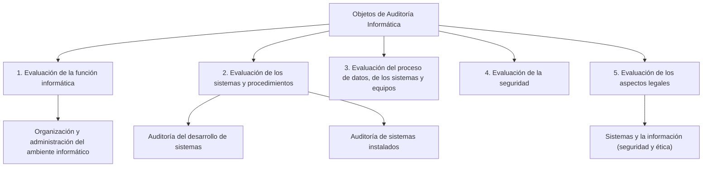

#### ***3- Objetos (secciones) o áreas de auditoría informática***

1.  Evaluación de la función informática (organización y administración del ambiente informático).
2.  Evaluación de los sistemas y procedimientos.
    1.  Auditoría del desarrollo de sistemas.
    2.  Auditoría de sistemas instalados.
3.  Evaluación del proceso de datos, de los sistemas y equipos.
4.  Evaluación de la seguridad.
5.  Evaluación de los aspectos legales de los sistemas y de la información (un auditor también puede ver si se están gestionando las cosas de un modo seguro o ético). 