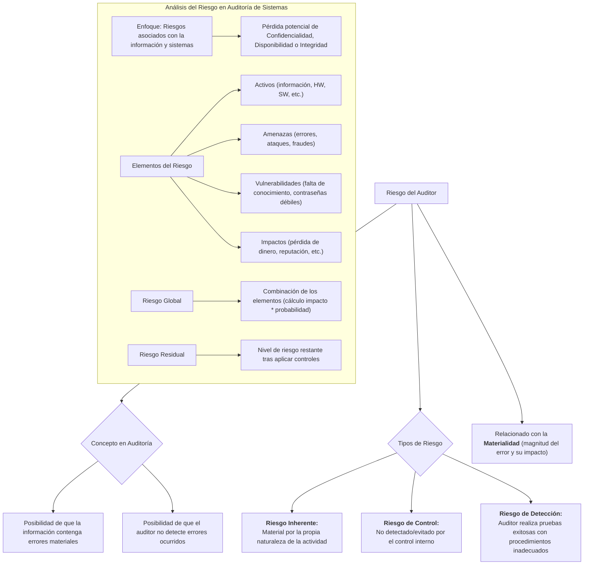

#### ***4- Riesgo del auditor (Etapa inicial)***

En la auditoría, el **riesgo** se refiere a la posibilidad de que la información pueda contener errores materiales (significativos en los estados contables), o bien la posibilidad de que el auditor no detecte errores ocurridos.

-   **Riesgo Inherente:** se vuelve material por la propia naturaleza de la actividad.
-   **Riesgo de control:** no son detectados o evitados por el control interno. Porque el hecho en sí mismo no está previsto, el control interno falla. *Ejemplo: No se sabe en la facultad que los alumnos ingresan y egresan con su equipamiento informático.*
-   **Riesgo de detección:** el riesgo que corre el auditor cuando realiza pruebas exitosas a partir de procedimientos inadecuados.

El concepto de riesgo está relacionado con el de materialidad, que se refiere a la magnitud del error en términos del impacto potencial para el conjunto de la organización. En general, esa materialidad es expresada en términos monetarios.

| Riesgo Inherente | Riesgo de Control | Riesgo de Detección |
| --- | --- | --- |
| Tipo de organización Tamaño de la organización Resistencia a la auditoría Cultura organizacional Estilo de Gerencia Estilo de comunicación Sistemas de gerencia y administración en la organización | Mecanismos de control financiero Mecanismos de control de gestión u operacional Información y comunicación Ambiente de control Supervisión Mecanismos de evaluación de riesgos | Experiencia del auditor Claridad de los objetivos o alcance Aptitud y actitud del equipo multidisciplinario Planificación y administración de los recursos Enfermedad, contingencia en el grupo auditor Conocimiento previo de la unidad a ser auditada Comprensión de la metodología |

[Los riesgos](#2--análisis-del-riesgo) que interesan en este ámbito **son los vinculados con la probabilidad de la presentación de un desastre.** Un desastre es todo suceso sujeto a un cierto grado de incertidumbre en cuanto a su ocurrencia, pero que cuando ocurre tiene potencial como para interrumpir o afectar seriamente la operación normal de un negocio.

**Los riesgos deben ser clasificados a efectos de priorizar las acciones,** en conformidad con la sensibilidad al tiempo (necesario para que se reanude el negocio luego de la ocurrencia de un desastre). La evaluación del riesgo debe considerar la tolerancia del sistema; esto es, la capacidad de enfrentar una interrupción de los sistemas. La tolerancia puede ser expresada como un valor monetario.

##### **Análisis del riesgo**

El auditor de sistemas está enfocado en una clase particular de **riesgos asociados con la información y con los sistemas y procesos subyacentes de información que generan, almacenan y manipulan información.** Esta clase de riesgo se define por la pérdida potencial de confidencialidad, disponibilidad o integridad de la información.

**Elementos del riesgo:**

-   **Activos:** información, datos, HW, sw, servicios, documentos, personal, etc.
-   **Amenazas:** son el resultado de un análisis de vulnerabilidades: errores, ataque malicioso, fraude, robo, fallas de equipos, fallas de sw.
-   **Vulnerabilidades**: lo que es atacable: falta de conocimientos del usuario, falta de funcionalidad de la seguridad, mala elección de las contraseñas, tecnología no probada, transmisiones no seguras, etc.
-   **Impactos:** son las perdidas consecuentes de la ocurrencia de una amenaza: perdida directa de dinero, violación de las leyes, perdida de reputación, violación de la confianza, perdida de oportunidad de negocio, reducción de la eficiencia, interrupción de las actividades del negocio.
-   **Riesgo Global:** Una vez que los elementos del riesgo se establecen, se combinan para formar el carácter global del riesgo. (cálculo del impacto de probabilidad para cada amenaza).
-   **Riesgo Residual:** es el nivel de riesgo restante una vez que se han aplicado los controles. Puede ser utilizado por la gerencia para identificar las áreas en que se requiere más control para reducir aún más los riesgos, o bien para identificar puntos de control que están siendo sobre-controlados. 