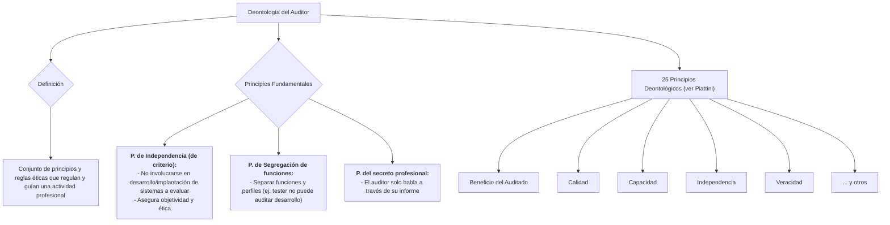

#### ***5- Deontología (normas éticas) del auditor***

Es el conjunto de principios y reglas éticas que regulan y guían una actividad profesional. Estas normas determinan los deberes mínimamente exigibles para los profesionales en el desempeño de su actividad.

**Los principios fundamentales son:**

-   **P. de Independencia (de criterio):** Estructura organizativa. No debe involucrarse en el desarrollo e implantación de los sistemas que serán objeto de evaluación (sí definir los puntos de control y pistas de auditoría) → Asegura que el auditor va a ser ÉTICO y OBJETIVO.
    -   NO puede auditar nada que lo vincule lineal y/o jerárquicamente con lo que está auditando. NO puede auditarse a sí mismo ni enviar, por ejemplo, a un ingeniero a evaluar el área.
    -   NO puede estar involucrado en el desarrollo de las aplicaciones que debe auditar.
    -   SÍ puede intervenir en la definición de puntos de la auditoría.
-   **P. de Segregación de funciones:** Separar las funciones y perfiles (si soy tester, no puedo auditar desarrollo de sw). Tiene que ver con la formación profesional.
-   **P. del secreto profesional:** EL profesional habla a través de su informe personal. NO hacerlo fuera de ello.

**25 Principios deontológicos del auditor informático:** \[ver Piattini]

1.  Principio del Beneficio del Auditado.
2.  Principio de Calidad.
3.  Principio de Capacidad
4.  Principio de Cautela
5.  Principio de Comportamiento Profesional
6.  Principio de Concentración en el trabajo.
7.  Principio de Confianza
8.  Principio de Criterio Propio
9.  Principio de Discreción
10. Principio de Economía
11. Principio de Formación Continuada
12. Principio de Fortalecimiento y Respeto
13. Principio de Independencia
14. Principio de Información Suficiente
15. Principio de Integridad Moral
16. Principio de Legalidad
17. Principio de Libre Competencia
18. Principio de no discriminación
19. Principio de no injerencia
20. Principio de Precisión
21. Principio de Publicidad adecuada
22. Principio de Responsabilidad
23. Principio de Secreto Profesional
24. Principio de Servicio Público
25. Principio de Veracidad 