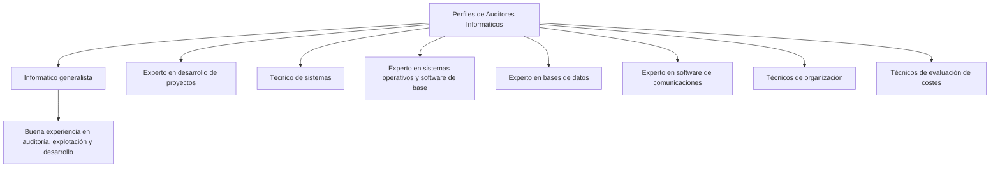

### Perfiles de Auditores Informáticos

-   Informático generalista: Experiencia muy buena en auditoría. Generalmente es importante que sea un conocedor de Explotación y Desarrollo.
-   Experto en desarrollo de proyectos.
-   Técnico de sistemas.
-   Experto en sistemas operativos y software de base.
-   Experto en bases de datos.
-   Experto en software de comunicaciones.
-   Técnicos de organización.
-   Técnicos de evaluación de costes. 