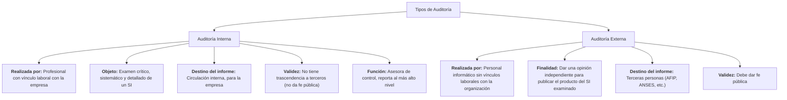

### Tipos de auditoría

#### ***Auditoría interna***

Es el examen crítico, sistemático y detallado de un sistema de información de una unidad económica, realizado por un profesional con vínculos laborales con la misma, utilizando técnicas determinadas y con el objeto de emitir informes y formular sugerencias para el mejoramiento de la misma. Estos informes **son de circulación interna** y no tienen trascendencia a terceros **pues no se producen bajo la figura de la fe pública.**

La auditoría interna es un servicio que **reporta al más alto nivel de la dirección de la organización** y **tiene características de función asesora de control**, por tanto, no puede ni debe tener autoridad de línea sobre ningún funcionario de la empresa, a excepción de los que forman parte de la planta de la oficina de auditoría interna, ni debe en modo alguno involucrarse o comprometerse con las operaciones de los sistemas de la empresa ⇒ **No la puede hacer un personal "jefe de línea".**

-   Existe un vínculo laboral entre el auditor y la organización.
-   El diagnóstico del auditor se encuentra destinado a la empresa.
-   La auditoría interna no puede dar fe pública.

#### ***Auditoría externa***

**Finalidad:** esa empresa necesita comunicar algo. Por ejemplo, para decir que un sistema pasa un nivel de seguridad ⇒ Se hace cuando se tiene **la intención de publicar el producto del SI examinado** a fin de anexar una opinión que le dé autenticidad y confiabilidad en las declaraciones del auditor.

Es el examen crítico, sistemático y detallado de un SI de una unidad económica, realizado por personal informático **sin vínculos laborales con la organización**, para dar una opinión independiente sobre la forma en que opera el sistema, el control interno del mismo y formular sugerencias para su mejoramiento.

-   Existe una relación contractual entre el auditor y la organización.
-   El dictamen está destinado a terceras personas (por ejemplo: ATP, ANSES, AFIP, etc.)
-   La auditoría externa debe dar fe pública. 