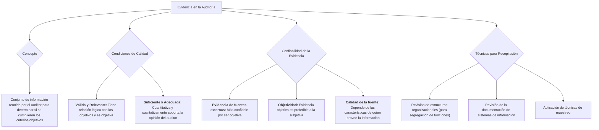

### Evidencia en la auditoría

El concepto de **evidencia** es definido como el conjunto de información que ha reunido el auditor, y que dispone para determinar si el ente o los datos auditados han cumplido con los criterios u objetivos de auditoría.

**La evidencia debe reunir condiciones de calidad** → válida y relevante, y en cantidad suficiente.

**La evidencia tiene una serie de calificativos, a saber:**

-   **Relevante,** que tiene una relación lógica con los objetivos de la auditoría.
-   **Fiable,** que es válida y objetiva, aunque con nivel de confianza.
-   **Suficiente,** que es de tipo cuantitativo para soportar la opinión profesional del auditor.
-   **Adecuada**, que es de tiempo cualitativo para afectar las conclusiones del auditor.

Se debe considerar la **confiabilidad de la evidencia** en que se apoya el auditor:

-   **Evidencia de fuentes externas:** aquella obtenida por fuera de la organización. Es más confiable ya que en principio, es objetiva.
-   **Objetividad:** la evidencia objetiva es más preferible a la que tiene que emitirse un juicio de valor.
-   **Calidad de la fuente de evidencia:** la calificación de la confiabilidad de la evidencia depende de las características de quien provee la información.

**Técnicas para recopilación de evidencias:**

-   **Revisión de estructuras organizacionales:** verificar el cumplimiento de la segregación de funciones.
-   **Revisión de la documentación de sistemas de información:** todo lo relacionado con la documentación generada durante la metodología particular de desarrollo de software adoptada por la organización.
-   **Aplicación de técnicas de muestreo.** 